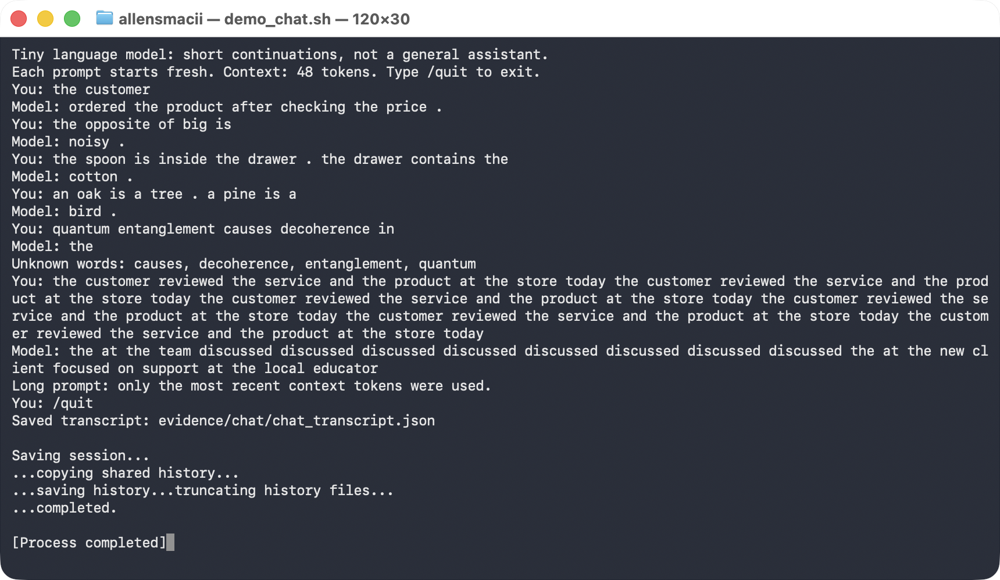

# McDonald GPT — Class 4: Building a Custom LLM

I trained a tiny nanoGPT language model from scratch three times — once on the classroom
starter corpus and twice with a different corpus extension — and measured each one on the
same fixed 48-case language eval suite, before and after training.

**Repository:** https://github.com/greycatallen/mcdonald-gpt
**Model:** Andrej Karpathy's nanoGPT ([`nanogpt_model.py`](nanogpt_model.py), pinned to
upstream commit `3adf61e154c3fe3fca428ad6bc3818b27a3b8291` and hash-checked by the notebook).
No API keys, no pretrained weights, no other model. CPU only.

## Results at a glance

| # | Experiment | Corpus added to the classroom sentences | Correct / 48 | Coverage | Accuracy among scorable |
|---|---|---|---:|---:|---:|
| 1 | Starter | nothing | 20 | 50.0% | 83.3% |
| 2 | McDonald's | 10 annual reports + 3 CEO letters | **23** | 50.0% | **95.8%** |
| 3 | Targeted | teaching sentences for 4 eval categories | **30** | **75.0%** | 83.3% |

- **Both extensions beat the baseline, for different reasons.** The McDonald's corpus left
  coverage unchanged at 50% and answered the *same* questions better (20/24 → 23/24). The
  targeted corpus mostly made new questions answerable (coverage 50% → 75%).
- **Relevance mattered far more than volume.** The targeted corpus added about 4% as much text
  as the McDonald's corpus (92 thousand vs 2.3 million characters) and gained more than three
  times as many cases.
- **Data quality mattered most of all.** Five of the thirteen McDonald's PDFs extract as
  garbage. Left unrepaired, they dropped the score to 3/48 (§9).
- **My prediction (P2) was not met** by the bar I set before training: I predicted at least
  +5 cases from the McDonald's material, and got +3 (§4).
- A seed sweep puts run-to-run noise at about ±0.5 cases, so differences of 1–2 cases are
  not treated as findings (§8).

---

## Contents

1. [Overview](#1-overview)
2. [How to run it](#2-how-to-run-it)
3. [My three choices](#3-my-three-choices)
4. [My prediction, written before training](#4-my-prediction-written-before-training)
5. [The corpora](#5-the-corpora)
6. [The runs](#6-the-runs)
7. [Evidence from the starter run](#7-evidence-from-the-starter-run)
8. [The 48-case language evals](#8-the-48-case-language-evals)
9. [The corpus extensions](#9-the-corpus-extensions)
10. [Keeping the evals out of training](#10-keeping-the-evals-out-of-training)
11. [Chat interface](#11-chat-interface)
12. [What I learned — in my own words](#12-what-i-learned--in-my-own-words)
13. [One limitation and my next experiment](#13-one-limitation-and-my-next-experiment)
14. [Repository map](#14-repository-map)

---

## 1. Overview

The assignment: choose a corpus, a number of training steps and a learning rate; train a small
word-level transformer; test it on an eval suite that is kept out of the training data; and talk
to the result through a chat interface.

The model is small enough to inspect completely: 2 transformer blocks, 4 attention heads,
64-number embeddings and a 48-token context window, trained with AdamW using warmup and cosine
decay. With the starter vocabulary of 136 word types that is **111,872 parameters**.

The goal is not a capable chatbot. It is to be able to point at a specific token ID, a specific
64-number vector, a specific gradient and a specific weight update, and explain how they connect.

---

## 2. How to run it

### Setup

```bash
git clone https://github.com/greycatallen/mcdonald-gpt.git
cd mcdonald-gpt
python3 -m venv .venv
./.venv/bin/pip install -r requirements.txt numpy
```

`numpy` has to be installed explicitly. `run_evals.py` hashes model weights with
`tensor.numpy()`, and on a torch-only install that fails with
`RuntimeError: Numpy is not available`. This is the only deviation from the upstream setup.

### In the notebook

Open [`custom_llm.ipynb`](custom_llm.ipynb) in Jupyter, VS Code or Colab, set the three choices
in Section 1, and Run All. In Colab, run Sections 1–2 once to create `/content/corpus`, upload
corpus files there, then Run All — opening a notebook from GitHub does not copy this
repository's folders.

### Reproduce all three experiments

Each experiment points at its own corpus folder, so no experiment's material can leak into
another's. [`scripts/run_experiment.py`](scripts/run_experiment.py) sets the choices and
executes the notebook with its outputs kept:

```bash
# Experiment 1 — starter corpus only
./.venv/bin/python scripts/run_experiment.py notebooks/experiment1-starter.executed.ipynb corpus_sets/starter 3000 0.001

# Experiment 2 — McDonald's (rebuilds the 5 recovered text files first; see §9)
./.venv/bin/python scripts/recover_pdf_text.py
./.venv/bin/python scripts/run_experiment.py notebooks/experiment2-mcdonalds.executed.ipynb corpus_sets/mcdonalds_all 3000 0.001

# Experiment 3 — targeted teaching material
./.venv/bin/python scripts/build_targeted_corpus.py targeted
./.venv/bin/python scripts/run_experiment.py notebooks/experiment3-targeted.executed.ipynb corpus_sets/targeted 3000 0.001

# Check no eval material reached any training corpus (§10)
./.venv/bin/python scripts/audit_leakage.py
```

### Re-run the evals on a saved model (no retraining)

```bash
./.venv/bin/python run_evals.py --model evidence/experiment3-targeted/model.pt --output results/final-evals
./.venv/bin/python run_evals.py --model evidence/experiment3-targeted/model_untrained.pt --stage untrained --output results/untrained-evals
```

This reproduces Experiment 3's 30/48 exactly. Use a fresh `--output` folder each time.

### Confirm the eval suite is unmodified

```bash
shasum -a 256 evals/language_evals.json
# e8affcd72841e3ed7da5c0b6b116327fe9f69c9abd66a1180d1d88ceaa3e17f7
```

This matches the hash pinned in the notebook's setup cell and in the upstream repository.

---

## 3. My three choices

| Choice | Value | Reason |
|---|---|---|
| Corpus | Exp 1: classroom only · Exp 2: + McDonald's filings · Exp 3: + targeted teaching material | Exp 2 tests my own prediction. Exp 3 satisfies the requirement to extend the corpus for at least two eval categories. Running both separates "does *more* text help?" from "does *relevant* text help?". |
| Training steps | 3000 | The notebook's main-experiment budget (`# 10 for setup; 3000 for the main experiment`). At batch size 32 that is about 23 passes over the starter corpus, and it takes ~13 seconds on CPU. |
| Learning rate | 0.001 | The standard AdamW default, suited to a model this size. Kept **identical in all three experiments** so any difference between them comes from the corpus, not the optimizer. |

**Why a learning rate that is too large or too small is a problem.** The learning rate scales
every weight update. Too large, and each step overshoots the minimum the optimizer is heading
for, so the loss curve goes jagged or diverges. Too small, and each step barely moves the
weights, so the model is still underfit when the step budget runs out. The notebook applies
warmup and then cosine decay, so 0.001 is the *peak* rate, not a constant one.

### Setup check: 10 steps

Before the real runs I ran the notebook at `TRAINING_STEPS = 10`, the value it labels "for
setup". Everything completed in 7.9 seconds with no errors, and the model learned essentially
nothing — as expected:

| Stage | Correct / 48 | Scorable / 48 | Accuracy among scorable | Coverage |
|---|---:|---:|---:|---:|
| Untrained | 9 | 24 | 37.5% | 50% |
| After 10 steps | 9 | 24 | 37.5% | 50% |

Loss moved from 4.926 to 4.208. A uniform guess over 136 words costs ln(136) = **4.913**, so
after 10 steps the model was still close to guessing at random. Full output:
[`evidence/smoke-10-steps/`](evidence/smoke-10-steps/).

---

## 4. My prediction, written before training

This section was committed as `16faf8e`, before any graded training run (the Experiment 1
commit, `65db4cd`, comes after it). My prediction and the Experiment 1 claims below are exactly
as committed; the counter-prediction is summarised, and the scorecards were added after the
runs.

### My prediction

**P1. Adding new training material will significantly improve the evaluation results.**

**P2. Training on McDonald's financial statements and CEO letters to consumers will be
enough, on its own, to produce that significant improvement.**

My reasoning: the starter corpus is small and narrow. Real business prose is far larger and
more varied than synthetic classroom sentences, so a model trained on it should have more
language to draw on and should therefore do better on a general language test.

**What counts as "significant", agreed before the run:** an increase of **at least 5 cases
out of 48** in all-case success over the Experiment 1 trained baseline. Anything smaller is
noise at this scale — a single case is 2.1 percentage points.

### Counter-prediction, also recorded before training

I built this project with an AI coding assistant, which disagreed with P2 and recorded its
reasons at the same commit:

1. The 24 `extend_corpus` cases need words like `salmon`, `freezes`, `cold` and `ice`, which
   annual reports do not contain — so those cases should stay unreadable and score 0.
2. The tokenizer keeps only the 509 most frequent word types. Financial vocabulary would compete
   for those slots and could push out starter words, making the score go **down**.
3. So the targeted corpus (Experiment 3) should beat the McDonald's corpus (Experiment 2).

### Detailed predictions for Experiment 1

| # | Claim | Committed value |
|---|---|---|
| 1 | Validation loss falls from ~4.93 | to **1.6 – 2.2** |
| 2 | Train/validation gap stays small — **no real overfitting**, because both splits come from the same template generator | gap **< 0.2** |
| 3 | `extend_corpus` cannot improve — the words are absent from the vocabulary | **0 / 24, 0% coverage** |
| 4 | `starter_patterns` improves substantially | 37.5% → **60 – 85%** |
| 5 | `starter_transfer` improves less, since it reuses known words in new sentence shapes | 37.5% → **40 – 60%** |
| 6 | Overall, hard-capped at 24/48 by out-of-vocabulary cases | **14 – 19 / 48** |
| 7 | `customer`'s nearest neighbours become its slot-mates, not its synonyms | `shopper`, `client`, `buyer`, `consumer`, `subscriber` |

The upstream repo includes a reference run at this exact configuration
(`examples/reference/history.json`). It was deliberately not opened before these numbers were
committed.

### Scorecard: Experiment 1

**Three of the seven claims were wrong.**

| # | Claim | Predicted | Measured | |
|---|---|---|---|---|
| 1 | Validation loss | 1.6 – 2.2 | **0.706** | ❌ fell much further |
| 2 | Train/val gap | < 0.2 | **0.028** | ✅ |
| 3 | `extend_corpus` | 0/24, 0% | **0/24, 0%** | ✅ |
| 4 | `starter_patterns` | 60 – 85% | **100%** (16/16) | ❌ exceeded |
| 5 | `starter_transfer` | 40 – 60% | **50%** (4/8) | ✅ |
| 6 | Overall | 14 – 19 | **20** | ❌ off by one |
| 7 | `customer`'s neighbours | the five words above | **exactly those five** | ✅ |

Claims 1, 4 and 6 all failed the same way: the starter corpus is far more learnable than
expected. It is generated from a handful of sentence templates, so once the model has the
templates there is very little uncertainty left. Claim 6 failed only because claim 4 did. The
binding constraint was how *repetitive* the corpus is, not how *small* the model is.

### Scorecard: P1 and P2

| Claim | Predicted | Measured | |
|---|---|---|---|
| P2 — McDonald's alone gives ≥ +5 | 20 → 25 or more | 20 → **23** (+3) | ❌ **not met** |
| P1 — added material improves results | improvement | +3 (Exp 2), +10 (Exp 3) | ✅ in direction, not size |
| Counter-prediction — McDonald's makes it **worse** | score falls | score **rose** by 3 | ❌ wrong |
| Counter-prediction — Exp 3 beats Exp 2 | Exp 3 > Exp 2 | 30 vs 23 | ✅ |

P2 fails by the bar I set myself. But its direction was right, and the counter-prediction that
the McDonald's material would be destructive was wrong once the corrupt PDFs were repaired:
coverage held at exactly 50%, and accuracy on the answerable cases rose from 83.3% to 95.8%.

What P1 misses is that the size of the gain had almost nothing to do with the amount of text:
Experiment 3 added about 4% as much text as Experiment 2 and gained more than three times as
many cases.

---

## 5. The corpora

### What each experiment trained on

Every experiment uses `CORPUS = "classroom"`, which means **the notebook's classroom sentences
plus every file in the chosen corpus folder**. The classroom sentences are the constant; each
experiment adds one extension on top.

| Experiment | Corpus folder | Files added | What they are |
|---|---|---:|---|
| 1 | [`corpus_sets/starter/`](corpus_sets/starter/) | 0 | nothing — classroom sentences only |
| 2 | [`corpus_sets/mcdonalds_all/`](corpus_sets/mcdonalds_all/) | 13 | 10 McDonald's annual reports (2016–2025) and 3 CEO letters to shareholders (2023–2025) |
| 3 | [`corpus_sets/targeted/`](corpus_sets/targeted/) | 5 | teaching sentences I generated for four eval categories |

**The classroom sentences** are not a file; they are generated by `classroom_corpus()` in
[`custom_llm.py`](custom_llm.py) (line 228). Nested loops fill 8 sentence frames across 8
domains (shopping, products, banking, fruit, transport, software, health, education):

| | Count |
|---|---:|
| 8 domains × 6 nouns × 4 contexts × 4 adjectives × 8 frames | 6,144 |
| + 6 nouns × 6 products × 6 verbs | 216 |
| **Sentences generated** | **6,360** |
| − withheld because they contain an eval prompt (§10) | −160 |
| − duplicates removed | −1,608 |
| **Unique training passages** | **4,592** |

### Sources and permissions

| Corpus | Source | Published here |
|---|---|---|
| Classroom | Generated by the notebook | n/a |
| McDonald's | McDonald's own public investor-relations documents — annual reports (SEC Form 10-K) and CEO letters, available from SEC EDGAR and the company's investor-relations site. ~820 pages. | Yes: originals in [`corpus_sets/mcdonalds/`](corpus_sets/mcdonalds/); the set actually trained on in [`corpus_sets/mcdonalds_all/`](corpus_sets/mcdonalds_all/) |
| Targeted | Written for this assignment by [`scripts/build_targeted_corpus.py`](scripts/build_targeted_corpus.py) | Yes: [`corpus_sets/targeted/`](corpus_sets/targeted/) |

None of the material contains personal or confidential data. The McDonald's documents are
third-party copyrighted filings, republished here as public company documents so the run can be
reproduced. Per-file SHA-256 hashes, page counts and extraction details are in
[`docs/corpus-sources.md`](docs/corpus-sources.md).

### Checking the PDF extraction

Three problems came up, and each was checked directly rather than assumed:

**1. Five PDFs extract as garbage.** The 2021, 2022, 2023, 2024 and 2025 annual reports use a
font encoding that `pypdf` cannot turn into text. 332 of their pages come out as control
characters. The notebook raised **no warning about this**, and its file previews looked fine because the
first page of every report extracts cleanly — the corruption starts around page 6. It was only
found by reading the middle of the extracted `corpus.txt`. How this was diagnosed and repaired
is in §9.

**2. One PDF was encrypted.** The 2018 report carries an owner-password flag, and the notebook
rejects encrypted files. It has **no user password** — `pypdf` opens it with an empty string, so
nothing was bypassed; the flag only restricts printing and editing. Following the notebook's own
error message ("export an unlocked copy you are allowed to use"), its pages were re-saved
unlocked and checked to be identical (94 pages, same text on page 1).

**3. Four pages produced no text.** Each was opened and counted:

| File | Page | Finding |
|---|---:|---|
| `2020 Annual Report.pdf` | 98 | 0 characters, 12 images — a graphical back cover |
| `MCD 2025 Annual Report.pdf` | 2 | 0 characters, 0 images — blank |
| `MCD 2025 Annual Report.pdf` | 85 | 0 characters, 0 images — blank |
| `McDonalds_2018_Annual_Report_unlocked.pdf` | 25 | 0 characters, 0 images — blank |

Three are blank and one is cover art. Nothing of value is lost.

### Measured corpus facts

| | Exp 1 | Exp 2 | Exp 3 |
|---|---:|---:|---:|
| Vocabulary size | 136 | **512** (at the cap) | 490 |
| Training unknown-token rate | 0.00% | **21.24%** | 0.00% |
| Held-out unknown-token rate | 0.00% | **20.81%** | 0.20% |
| Train / validation passages | 4,132 / 460 | 21,779 / 2,420 | 4,431 / 493 |
| New unique passages from added files | — | 19,607 | 332 |
| Garbled tokens in the vocabulary | 0 | 16 (3.1%) | 0 |

Per-experiment files: `corpus_manifest.json` and `vocabulary_report.json` in
[Exp 1](evidence/experiment1-starter/) · [Exp 2](evidence/experiment2-mcdonalds/) ·
[Exp 3](evidence/experiment3-targeted/).

**The vocabulary cap.** The tokenizer keeps the 509 most frequent word types, plus 3 special
tokens (`<UNK>`, `<BOS>`, `<EOS>`) — hence 512. Every other word becomes `<UNK>`. Experiments 1
and 3 stay under the cap. Experiment 2 hits it: McDonald's filings contain far more than 509
distinct words, so about a fifth of its training tokens become `<UNK>`. Once the cap binds,
adding a word means pushing a different one out.

**The split is by passage, not by source file.** Two passages from the same template can land on
opposite sides of the train/validation split and look almost identical, which limits what the
held-out loss can show (§7).

---

## 6. The runs

| | Exp 1 | Exp 2 | Exp 3 |
|---|---:|---:|---:|
| Completed steps | 3000 / 3000 | 3000 / 3000 | 3000 / 3000 |
| Training time | 13.4 s | 24.8 s | 13.1 s |
| Whole notebook | 21.8 s | 46.8 s | 18.8 s |
| Parameters | 111,872 | 135,936 | 134,528 |
| Interrupted? | No | No | No |

**Hardware:** macOS 26.6.2 on Apple Silicon (arm64), CPU only, PyTorch 2.14.0, Python 3.12.14.
The architecture, seed (42), batch size (32), step count and learning rate are identical in all
three. Parameter counts differ only because the embedding table grows with the vocabulary.

**Executed notebooks** (outputs kept): [Exp 1](notebooks/experiment1-starter.executed.ipynb) ·
[Exp 2](notebooks/experiment2-mcdonalds.executed.ipynb) ·
[Exp 3](notebooks/experiment3-targeted.executed.ipynb)

**Per-run files:** `config.json`, `training.csv`, `training_summary.json`, `history.json`,
`temperature_comparison.json`, `tokenization.json`, `inspection.json` and `checkpoint.json` are
in each experiment's folder under [`evidence/`](evidence/).

### What went wrong along the way

No run was interrupted, but four problems came up. Each was caught, fixed, and is recorded here
rather than hidden:

1. **The evals crashed on a torch-only install** (`RuntimeError: Numpy is not available`).
   `numpy` is missing from `requirements.txt`. Fixed by installing it (§2).
2. **An encrypted PDF stopped the whole corpus import**, not just that one file. Fixed by
   re-saving it unlocked (§5).
3. **The starter baseline was nearly contaminated.** The McDonald's PDFs were first placed in the
   default `corpus/` folder, which Experiment 1 would also have read. It was caught only because
   the encrypted PDF made that run fail first. Fixed by giving each experiment its own folder.
4. **The first Experiment 3 corpus contained three eval prompts, word for word.** The notebook's
   guard refused to train on it, so no contaminated model was ever produced. Details in §10.

A fifth issue was not a crash: the first Experiment 2 corpus included 332 pages of garbled
text, and that run completed normally with a misleading result. It is kept as a diagnostic, not reported as a
result (§9).

---

## 7. Evidence from the starter run

All numbers in this section come from Experiment 1. The loss curves for the other two runs are
at [Exp 2](evidence/experiment2-mcdonalds/training_curves.svg) and
[Exp 3](evidence/experiment3-targeted/training_curves.svg).

### Loss curves


Every measured value, from [`history.json`](evidence/experiment1-starter/history.json):

| Step | Training loss | Validation loss | Gap |
|---:|---:|---:|---:|
| 0 | 4.9263 | 4.9275 | 0.0012 |
| 1500 | 0.6821 | 0.7182 | 0.0361 |
| 3000 | 0.6783 | 0.7061 | 0.0278 |

These are **fixed evaluation panels**: the same 20 training and 20 validation documents at every
measurement, averaged over their next-token predictions. They are not a full-corpus loss.

- **Step 0 is exactly what random guessing costs.** ln(136) = 4.913, and an untrained model is a
  uniform guesser over 136 words.
- **Almost all the learning happens in the first half.** Loss falls from 4.93 to 0.68 by step
  1500, then moves only 0.0038 in the second half.
- **The validation gap never opens**, and even narrows. This is weak evidence, though: both
  splits come from the same template generator, so a held-out passage looks almost exactly like a
  training one. It shows the model did not memorize specific sentences; it cannot show that it
  handles new language. The eval suite's `starter_transfer` group is the real test of that.

### Text samples: untrained, halfway, final

Same generation settings each time. Full files:
[`step_0000.txt`](evidence/experiment1-starter/samples/step_0000.txt) ·
[`step_1500.txt`](evidence/experiment1-starter/samples/step_1500.txt) ·
[`step_3000.txt`](evidence/experiment1-starter/samples/step_3000.txt)

**Step 0:**
```
pear professor bond doctor course harvest team physician journey checking buyer delivery
traffic report the lecturer item offering and system <UNK> taste recommended mentioned bus
question customer at mortgage nurse in instructor
```

**Step 1500:**
```
our school has a question about the new educator and lesson .
a review of risk helped us understand the different deposit .
we learned about the important website during a discussion of data .
```

**Step 3000:**
```
our school has a question about the new educator and lesson .
a review of risk helped us understand the different deposit .
the report about the nurse explains the health in detail .
the consumer compared the offering after checking the price .
```

**What changed:** between step 0 and step 1500, word salad becomes grammatical sentences with
correct word order and full stops.

**What did not change:** between step 1500 and step 3000, the first two lines are identical word
for word. This matches the flat second half of the loss curve.

### One word, from text to vector

Files: [`tokenization.json`](evidence/experiment1-starter/tokenization.json) ·
[`inspection.json`](evidence/experiment1-starter/inspection.json)

The notebook follows the word **`customer`**, which is token **ID 28**. That ID selects row 28 of
the embedding table: a vector of 64 numbers. Its first number was `-0.057592` before training and
`+0.036634` after.

### One real gradient and weight update

The first optimizer step, for that first number:

| | Value |
|---|---|
| Weight before | `-0.057591915130615234` |
| Gradient | `+0.000692586530931294` |
| Learning rate at this step | `0.00001` |
| Weight after | `-0.057601906359195710` |

`-0.05759192 − (0.00001 × 0.00069) ≈ -0.05760191`. The weight moved by about one
hundred-thousandth. One step is invisible; the change only shows after 3000 of them. The learning
rate is `0.00001` here, not the configured 0.001, because training starts with a warmup.

### Next-token probabilities after `the customer`

| Before training | | After training | |
|---|---:|---|---:|
| `customer` | 1.60% | `reviewed` | 17.82% |
| `bus` | 1.07% | `recommended` | 17.12% |
| `educator` | 1.04% | `ordered` | 16.85% |
| `us` | 1.03% | `selected` | 16.34% |
| `application` | 1.01% | `compared` | 15.97% |
| `course` | 0.98% | `returned` | 14.28% |

Before training the distribution is almost flat (1/136 ≈ 0.74% each), and the top pick is the
nonsensical `the customer customer`. After training, **98.4% of the probability sits on six
words, all verbs a customer can do.** The model learned what kind of word comes next.

### Nearest neighbours of `customer`

Cosine similarity over all 64 numbers:

| Before training | | After training | |
|---|---:|---|---:|
| `bus` | 0.213 | `shopper` | **0.978** |
| `educator` | 0.203 | `client` | **0.977** |
| `helped` | 0.202 | `buyer` | **0.977** |
| `bank` | 0.201 | `subscriber` | **0.971** |
| `risk` | 0.198 | `consumer` | **0.970** |
| `selected` | 0.191 | `team` | 0.503 |

Before training the neighbours are random. After training they are exactly the five words
predicted in §4, all above 0.97, followed by a sharp drop to 0.503.

These similarities use all 64 numbers. The [embedding viewer](embedding-viewer.html) instead draws
each word in 3D, which squeezes 64 dimensions into 3 — so two words can look close on its map
without being close in the full space, or look far apart when they are close. The table above is
the reliable measure; the map is a rough picture. These six words fill the
same slot in the classroom sentence frames, so the model learned they are interchangeable — not
that it knows what a customer is.

### Temperature

[`temperature_comparison.json`](evidence/experiment1-starter/temperature_comparison.json)

| Temperature | Fourth sampled line |
|---|---|
| 0.3 | `the local consumer was mentioned in the purchase report yesterday .` |
| 0.8 | `the consumer compared the offering after checking the price .` |
| 1.2 | `the consumer compared the offering after checking the price .` |

The first three lines are identical at all three temperatures, and 0.8 and 1.2 give identical
text. This follows from the probability table above: when six words share 98% of the
probability almost evenly, sharpening or flattening the distribution rarely changes which one is
drawn.

**No weights changed.** Temperature divides the model's scores before they become
probabilities; it only affects sampling. All three columns come from the same trained model.

---

## 8. The 48-case language evals

The suite is [`evals/language_evals.json`](evals/language_evals.json), byte-identical to upstream
(§2). The runner, [`run_evals.py`](run_evals.py), only runs and scores the model; it never trains.

### How scoring works

1. Only the prompt is fed to the model. The answer choices are never shown to it.
2. The model's probabilities for the four candidate words are compared, and the highest wins.
   Correct scores 1; wrong or tied scores 0. Random guessing averages 25%.
3. Separately, a free continuation is generated (temperature 0.8, fixed seed, up to 24 tokens)
   and saved. **The score does not grade this text.**
4. If any word in the prompt or the four choices is outside the model's vocabulary, the case is
   marked `out_of_vocabulary` and scores 0.

That is why three numbers are reported, and each answers a different question:

- **Correct / 48** — the headline. Unreadable cases count as zero, so the rate cannot be
  inflated by skipping hard cases.
- **Coverage** — the share of cases the model has the words for at all. This is a property of
  the corpus, not of the model's reasoning.
- **Accuracy among scorable cases** — how well it does on the questions it *can* read. Always
  read this next to coverage, since it moves whenever coverage does.

### Results before and after training

| Experiment | Stage | Correct / 48 | Scorable / 48 | Accuracy among scorable | Coverage | Full results |
|---|---|---:|---:|---:|---:|---|
| 1. Starter | Untrained | 9 (18.75%) | 24 | 37.50% | 50.0% | [untrained/](evidence/experiment1-starter/language_evals/untrained/) |
| 1. Starter | **Trained** | **20 (41.67%)** | 24 | 83.33% | 50.0% | [final/](evidence/experiment1-starter/language_evals/final/) |
| 2. McDonald's | Untrained | 7 (14.58%) | 24 | 29.17% | 50.0% | [untrained/](evidence/experiment2-mcdonalds/language_evals/untrained/) |
| 2. McDonald's | **Trained** | **23 (47.92%)** | 24 | **95.83%** | 50.0% | [final/](evidence/experiment2-mcdonalds/language_evals/final/) |
| 3. Targeted | Untrained | 12 (25.00%) | 36 | 33.33% | 75.0% | [untrained/](evidence/experiment3-targeted/language_evals/untrained/) |
| 3. Targeted | **Trained** | **30 (62.50%)** | 36 | 83.33% | **75.0%** | [final/](evidence/experiment3-targeted/language_evals/final/) |

Every result folder holds all 48 cases as `eval_results.csv`, `eval_results.json`,
`eval_cases.json` and `eval_summary.json`.

**Training cannot change coverage.** In each experiment, coverage is the same before and after
training — training does not add words to the vocabulary. Only a different corpus does.

**Compare only within an experiment.** The untrained scores differ (9, 7, 12) because the
untrained models differ: a larger vocabulary means a different-shaped model with different random
guesses. The meaningful number is each experiment's untrained → trained change.

**Experiment 2 is the cleanest comparison in the project.** Its coverage is exactly the same as
Experiment 1's — the same 24 readable cases — so the two can be compared directly: 23 of 24
correct against 20 of 24. Because the vocabulary available to the evals did not change, that
gain comes from the model answering the same questions better, not from reading more of them.

### How big a difference is real?

To avoid over-reading small gaps, Experiment 3 was re-run with four different random seeds
(42–45), with everything else held fixed. Raw data:
[`evidence/variance/seed_variance.json`](evidence/variance/seed_variance.json).

| Corpus version | Scores across seeds | Mean | Std. dev. | Coverage |
|---|---|---:|---:|---|
| Targeted corpus without the word-form file | 31, 30, 30, 30 | 30.25 | 0.50 | 68.8% every seed |
| Targeted corpus as used in Experiment 3 | 30, 30, 31, 31 | 30.50 | 0.58 | 72.9 – 75.0% |

- **Score differences under about 1.5 cases are noise.** The two versions differ by a quarter of
  a case.
- **The coverage difference is real** — the ranges do not overlap. The word-form file (§9)
  reliably made about 3 more cases readable, and about zero more correct. Being able to *read* a
  question and being able to *answer* it are separate things.

### Loss cannot be compared across experiments

| Experiment | Validation loss at step 0 | Final validation loss | Final training loss |
|---|---:|---:|---:|
| 1 | 4.9275 | 0.7061 | 0.6783 |
| 2 | 6.2484 | 2.5499 | 2.6854 |
| 3 | 6.2494 | 0.7140 | 0.8090 |

Experiment 2's final loss is much higher, but it is predicting among 512 words rather than 136,
and even its random-guess starting point is higher (ln 512 = 6.24 vs ln 136 = 4.91). Losses over
different vocabularies are not a ranking. In Experiments 2 and 3 validation loss is slightly
*below* training loss; with only 20 documents per panel, which 20 were drawn matters more than any
generalization signal.

### Experiment 1 by group and category

| Group | Untrained | Trained | Coverage |
|---|---:|---:|---:|
| `starter_patterns` | 6/16 | **16/16** | 100% |
| `starter_transfer` | 3/8 | **4/8** | 100% |
| `extend_corpus` | 0/24 | 0/24 | **0%** |

| Category | Untrained | Trained | Coverage |
|---|---:|---:|---:|
| `domain_context` | 3/8 | **8/8** | 100% |
| `domain_place` | 3/8 | **8/8** | 100% |
| `new_wording` | 3/8 | **4/8** | 100% |
| `grammar`, `opposites`, `negation`, `reference`, `sequence`, `spatial_relations`, `everyday_knowledge`, `categories_and_analogies` | 0/3 each | 0/3 each | 0% each |

**What worked:** the two association categories reached 8/8 — exactly what the starter corpus
drills (`customer` → `service`, `surgeon` → `patient`).

**What did not:** `new_wording` reached only 4/8. Those cases use words the model has mastered,
in unfamiliar sentence shapes. It scores 100% on familiar templates and a coin flip once the
wording changes — it learned the templates, not the associations underneath. Every other zero in
the table is a 0%-coverage case the model could not read.

### Free continuations are a different thing from the score

The free text is generated separately and not graded. It often disagrees with the
multiple-choice answer:

| Case | Prompt | Multiple-choice pick | Free continuation |
|---|---|---|---|
| Exp 3 `lang_28` | `the opposite of hot is` | `cold` ✅ | `bright .` |
| Exp 3 `lang_43` | `water freezes into` | `ice` ✅ | `a drawer .` |
| Exp 3 `lang_46` | `a robin is a bird . a salmon is a` | `tool` ❌ | `tool .` |
| Exp 1 `lang_01` | `the report about the customer explains the` | `service` ✅ | `service in detail .` |
| Exp 1 `lang_25` | `one bird` | out of vocabulary (0) | `the new customer with another client at the store .` |

In Experiment 3, `the opposite of hot is` scores correctly, because `cold` is the most likely of
the four choices — yet left to itself the model writes `bright`. Picking the best of four supplied
words is much easier than producing the right word unaided.

`lang_25` shows the opposite problem. The model cannot read `one` or `bird`, so the case scores
0 — but its free text is a fluent English sentence. Judged on free text alone the model would look
like it understood the prompt; coverage shows it could not even represent it.

---

## 9. The corpus extensions

### Why these extensions

The assignment requires a corpus extension for at least two eval categories. Experiment 3 meets
that requirement. Experiment 2 goes beyond it: it tests my own prediction that McDonald's filings
would be enough on their own. Annual reports target none of the eight eval categories.

For Experiment 3 I taught **four categories and deliberately left four untaught** as a control.
If only the taught categories improve, the gain comes from matching the material to the task, not
just from adding more text.

| Taught (12 cases) | Untaught control (12 cases) |
|---|---|
| `opposites`, `spatial_relations`, `everyday_knowledge`, `categories_and_analogies` | `grammar`, `negation`, `reference`, `sequence` |

The gap to fill: a case is only scorable when every word in its prompt **and all four answer
choices** are in the vocabulary. The starter corpus contains none of `cold`, `full`, `quiet`,
`below`, `inside`, `ice`, `steam`, `fish`, `goat` or `metal`, so the 24 extension cases were not
answered wrongly — they were unreadable. The new material therefore has to introduce those
words, including the wrong answer choices.

### Experiment 2: McDonald's filings

#### The first attempt was ruined by bad data

The first Experiment 2 run used all 13 PDFs as extracted by `pypdf`, and scored **3/48** with
coverage collapsing to 8.3%. That run is kept in
[`evidence/diagnostics/exp2-corrupt-extraction/`](evidence/diagnostics/exp2-corrupt-extraction/)
but is not reported as a result, because the cause turned out to be the data, not the
hypothesis.

It was first explained as financial vocabulary crowding classroom words out of the 509-word
vocabulary. That explanation was wrong. The real cause was the five garbled PDFs from §5:

| | Corrupt run (13 PDFs as extracted) | Only the 8 clean PDFs |
|---|---:|---:|
| Garbled tokens in the vocabulary | **122 (23.8%)** | 14 (2.7%) |
| Starter words pushed out | **39** | 5 |
| Coverage | 8.3% | 50.0% |
| Score | 3/48 | 23/48 |

Nearly a quarter of the vocabulary was spent on control characters like `\x01` and `\x02`, and
they caused 34 of the 39 lost starter words — including `surgeon`, `nurse`, `teacher` and every
fruit and vehicle, the exact words the starter eval cases are built from. The clean-8 run
([`evidence/diagnostics/exp2-clean8-only/`](evidence/diagnostics/exp2-clean8-only/)) is what
isolated the cause.

**Lesson:** at this scale, data *quality* outweighed both the amount and the relevance of the
text. Off-topic text competed for vocabulary slots and mostly lost gracefully; unreadable text
competed for the same slots and wrecked the run.

#### Repairing the corpus so all 13 documents could be used

Dropping five documents was a diagnosis, not a fix. Inside those five PDFs the fonts are mixed:
the font used for the shareholder-letter prose reads normally, while the fonts used for the
financial tables are the broken ones. A single character shift does not decode them. PyMuPDF returns the same
garbage, and `pdfplumber` returns raw glyph codes (`(cid:43)(cid:36)…`), which confirms the fonts
carry no mapping back to letters — this is not a quirk of one library.

[`scripts/recover_pdf_text.py`](scripts/recover_pdf_text.py) keeps every text span that is already
readable English and drops the rest:

| File | Spans kept | Spans dropped | Words recovered |
|---|---:|---:|---:|
| 2023 Annual Report | 1,069 | 5,016 | 16,101 |
| MCD 2025 Annual Report | 282 | 6,191 | 1,674 |
| MCD 2021 Annual Report | 250 | 5,757 | 1,630 |
| McD 2024 Annual Report | 217 | 6,328 | 1,383 |
| MCD 2022 Annual Report | 214 | 5,641 | 1,370 |
| **Total** | **2,032** | **28,933** | **22,158** |

**This recovery is lossy.** It keeps the narrative prose and loses the financial tables from
those five reports. Recovering the tables would need OCR, which was not installed. The tables are
mostly numbers and add little to a word-level model.

Experiment 2 therefore trains on **all 13 documents**: 8 as full PDFs and 5 as recovered text. The
result: 16 garbled vocabulary tokens (3.1%), 5 starter words pushed out (all verbs that no eval
case needs), coverage 50%, and 23/48.

#### What the McDonald's corpus bought

| Group | Exp 1 | Exp 2 | Coverage (both) |
|---|---:|---:|---:|
| `starter_patterns` | 16/16 | 15/16 | 100% |
| `starter_transfer` | 4/8 | **8/8** | 100% |
| `extend_corpus` | 0/24 | 0/24 | 0% |
| **Total** | **20/48** | **23/48** | 50% |

The whole gain is in `starter_transfer`, which went from a coin flip to a perfect 8/8, at the
cost of one `starter_patterns` case. Business prose is full of multi-clause sentences the
template-generated starter corpus never produces, and that variety helped the model handle
familiar words in unfamiliar sentence shapes — the weakness Experiment 1 showed in §8. Because
coverage did not change, this is an improvement in what the model learned, not in its
vocabulary.

What the filings could not do is move `extend_corpus`: annual reports do not mention salmon or
ice, so those 24 cases stay unreadable however clean the text is.

### Experiment 3: targeted teaching material

**The material:** [`corpus_sets/targeted/`](corpus_sets/targeted/) — 2,442 sentences in five
files, generated by [`scripts/build_targeted_corpus.py`](scripts/build_targeted_corpus.py):
`opposites.txt`, `spatial_relations.txt`, `everyday_knowledge.txt`,
`categories_and_analogies.txt` and `word_forms.txt`.

It is written as varied practice, not one answer per test. For example, the
`the opposite of X is Y` pattern is taught on sixteen word pairs the suite never tests
(`big`/`small`, `wet`/`dry`, `near`/`far`, …). The words the suite *does* use — `hot`, `cold`,
`empty`, `full` — appear only in ordinary sentences like
`the soup was hot but the water was cold .`

#### Results

| Category | Exp 1 | Exp 3 | Coverage in Exp 3 | |
|---|---:|---:|---:|---|
| `opposites` | 0/3 | **3/3** | 100% | taught |
| `everyday_knowledge` | 0/3 | **2/3** | 100% | taught |
| `spatial_relations` | 0/3 | **2/3** | 100% | taught |
| `categories_and_analogies` | 0/3 | 1/3 | 100% | taught |
| `grammar` | 0/3 | 0/3 | 0% | control |
| `negation` | 0/3 | 0/3 | 0% | control |
| `reference` | 0/3 | 0/3 | 0% | control |
| `sequence` | 0/3 | 0/3 | 0% | control |
| `domain_context` | 8/8 | 8/8 | 100% | starter |
| `domain_place` | 8/8 | 8/8 | 100% | starter |
| `new_wording` | 4/8 | 6/8 | 100% | starter |
| **Total** | **20/48** | **30/48** | **75%** | |

**The control worked.** The four untaught categories stayed at 0% coverage in every run and
every seed. The four taught categories went from 0/12 at 0% coverage to **8/12 at 100% coverage**.

The `new_wording` gain (4/8 → 6/8) is suggestive — it points the same way as Experiment 2 — but
+2 cases is too close to the noise level in §8 to count as established.

#### The word-form finding

An earlier version of this corpus taught every *fact* the `everyday_knowledge` cases need, and
still scored 0/3 at 0% coverage. Each case was missing exactly one word form:

| Case | Needed | The corpus had |
|---|---|---|
| `lang_43` | `freezes` | `freeze` |
| `lang_44` | `uses` | `opened`, `keeps` |
| `lang_45` | `turn` | `turned` |

**Word-level tokenization has no idea that `freeze` and `freezes` are related** — they are two
unrelated token IDs. Adding a few ordinary sentences using the exact forms
(`the lake freezes when winter arrives .`) made the category readable and lifted it to 2/3. As §8
shows, this raised coverage without raising the overall score. These sentences were written
*because* the eval output showed the gap, so they are guided development (§10).

#### The failure that vocabulary cannot explain

`categories_and_analogies` has **100% coverage and still scores only 1/3.** The model has every
word in `a robin is a bird . a salmon is a ___` and all four choices, and still answers `tool`.
`opposites`, with the same treatment and the same coverage, scores 3/3.

This is a reasoning failure, not a vocabulary gap. These cases require carrying a relation from
the first sentence into the second. The corpus taught many `a X is a Y .` sentences, so the model
learned that shape and produces a plausible category word — but it never learned to pick the
category based on the earlier sentence.

### Coverage, learning, or both?

| Change | Effect on coverage | Effect on what the model learned |
|---|---|---|
| Exp 1 → Exp 2 (20 → 23) | **None** — 50% both | **All of it.** `starter_transfer` 4/8 → 8/8 on the same readable questions. |
| Exp 1 → Exp 3 (20 → 30) | **Large** — 50% → 75%, 12 more readable cases | Mostly from newly readable cases; `new_wording` +2 is within noise. |
| Adding the word-form file | **+3 readable cases**, reproducible across seeds | **None** — score unchanged within noise (§8). |

The two extensions improved the model in different ways. McDonald's prose improved how well the
model answers questions it could already read. The targeted material mostly let it read questions
it could not read before. And `categories_and_analogies`, at 100% coverage and 1/3, shows that
having the vocabulary is necessary but nowhere near sufficient.

---

## 10. Keeping the evals out of training

Including eval prompts, answer keys or eval outputs in a training corpus invalidates the results.
Four layers kept them apart.

**1. Reservation.** Before the train/validation split and before the vocabulary is built, the
notebook withholds any generated classroom sentence that contains an eval prompt. That removed
**160 passages covering 16 cases** in every run — see `eval_separation.json` for
[Exp 1](evidence/experiment1-starter/eval_separation.json) ·
[Exp 2](evidence/experiment2-mcdonalds/eval_separation.json) ·
[Exp 3](evidence/experiment3-targeted/eval_separation.json).

**2. Import rejection — and it caught a real leak.** The notebook scans added files for eval
prompts. My first draft of the Experiment 3 material contained three of them word for word:

| Case | Eval prompt | What I had written |
|---|---|---|
| `lang_43` | `water freezes into` | `water freezes into ice when the air is cold .` |
| `lang_44` | `a person uses an umbrella to stay` | `a person uses an umbrella to stay dry in the rain .` |
| `lang_45` | `to see in a dark room we turn on a` | `to see in a dark room we turn on a light .` |

The notebook refused to train, so **no model was ever trained on this and no result in this
repository comes from it.** The sentences were rewritten to teach the same facts in different
words.

**3. Location check.** The notebook refuses a corpus folder that is the repository root or
contains `evals/`.

**4. Two added audits.** The notebook stops at the *first* offending file, so one clean run does
not prove every file is clean. [`scripts/check_leakage.py`](scripts/check_leakage.py) checks every
corpus file (including PDFs) against all 48 prompts before training.
[`scripts/audit_leakage.py`](scripts/audit_leakage.py) then checks the text each model was
*actually* trained on (`evidence/*/corpus.txt`):

| Check | Result, all three experiments |
|---|---|
| An eval prompt word for word | ✅ none |
| A prompt together with its answer | ✅ none |
| A line containing all four answer choices of a case | ✅ none |
| Eval, chat or results files inside a corpus folder | ✅ none |
| Passages withheld before the split | ✅ 160 in every run |
| **An answer on the same line as most of its own prompt** | ✅ none |

The last check matters most: contamination that affects a score means the model saw a question
next to its answer. That never happens in any experiment.

### What these checks cannot rule out

All of the checks above look for exact or near-exact text. They cannot detect paraphrases or
overlapping facts. My own leak above was caught only because I copied the prompts exactly; a
slightly reworded version would have passed every check.

**Some facts in the targeted corpus overlap with the suite.** To make a case scorable, all four of
its answer choices must be taught — `lang_46`'s choices are `bird`, `tree`, `tool` and `fish`. In
teaching them, some word pairs match the suite's:

| Teaching list | Pairs used | Same pair as the suite |
|---|---:|---|
| Opposites | 16 | none — avoided on purpose |
| Containers | 6 | `bag`/`book` |
| Above / below | 5 | `lamp`/`desk` |
| Left / right | 5 | `ball`/`box` |
| Grows into | 7 | `puppy`/`dog`, `kitten`/`cat` |
| Is-a | 25 | `robin`/`bird`, `salmon`/`fish`, `carrot`/`vegetable`, `apple`/`fruit` |

The suite's own guidance allows this ("the underlying facts may overlap"), and none of these
sentences uses the suite's wording. The results also argue against memorization: the category
with **no** shared pairs scores best, and the one with the **most** scores worst.

| Category | Pairs shared with the suite | Score |
|---|---:|---:|
| `opposites` | 0 | 3/3 |
| `spatial_relations` | 3 | 2/3 |
| `categories_and_analogies` | 6 | 1/3 |

`a salmon is a fish .` is in the training data, and the model still answers
`a robin is a bird . a salmon is a` with `tool`. A cleaner design would teach every required word
in pairs the suite never uses (`a salmon swims upstream .`); that is the first thing I would
change.

### These are development tests, not a final exam

The suite is public, and I read it while writing the Experiment 3 material — I chose the four
categories from it, and the word-form file exists because its output showed the gap. That is
normal iteration, but it means these scores measure guided development, not how the model would
do on unseen questions. Claiming that would need new test cases that influenced none of these
choices. **No such claim is made here.**

---

## 11. Chat interface

### Launch it

```bash
./.venv/bin/python chat.py --model evidence/experiment3-targeted/model.pt --transcript results/my-chat.json
```

Type a prompt and press Enter; type `/quit` to exit. `--transcript` must be a new filename, so
earlier sessions are never overwritten. In the notebook instead: Section 10, edit `CHAT_PROMPT`,
and run the cell. To replay the session shown below: `./scripts/demo_chat.sh`.

### Which model

| | |
|---|---|
| Experiment | 3 (targeted), run folder `20260917T214756_320104Z` |
| Weights | [`evidence/experiment3-targeted/model.pt`](evidence/experiment3-targeted/model.pt) |
| Model SHA-256 | `204fd529826cb11f8f8635be844f48332761e5fbdef815d7f2c9c009f552b591` |
| Parameters | 134,528 |
| Settings | temperature 0.8, up to 24 tokens, seed 2026 + turn number |

### The session



The same session is saved three ways:
[`chat-screenshot.png`](evidence/chat/chat-screenshot.png) (screen capture),
[`chat-session.typescript`](evidence/chat/chat-session.typescript) (a `script(1)` terminal
recording) and [`chat_transcript.json`](evidence/chat/chat_transcript.json) (every prompt, reply
and seed, plus the model hash). The transcript's hash matches the weights above, so the replies
come from this model — not canned text or another model.

| # | My prompt | The model's reply | |
|---|---|---|---|
| 1 | `the customer` | `ordered the product after checking the price .` | ✅ fluent, on topic |
| 2 | `the opposite of big is` | `noisy .` | ❌ should be `small` |
| 3 | `the spoon is inside the drawer . the drawer contains the` | `cotton .` | ❌ should be `spoon` |
| 4 | `an oak is a tree . a pine is a` | `bird .` | ❌ should be `tree` |
| 5 | `quantum entanglement causes decoherence in` | `the` — *Unknown words: causes, decoherence, entanglement, quantum* | ⚠️ unknown words |
| 6 | a 66-token prompt repeating one sentence | `the at the team discussed discussed discussed …` — *Long prompt: only the most recent context tokens were used.* | ⚠️ truncated, then stuck in a loop |

**Four of the six replies are failures, and they are shown on purpose.** Prompts 2–4 test skills
Experiment 3 was trained on, and it scores well on them in the multiple-choice evals — but
choosing among four given words is much easier than producing the right word unaided (§8).

### Limitations

1. **Unknown words** (prompt 5). All four content words are outside the 490-word vocabulary. The
   model does not refuse; it treats them as `<UNK>` and carries on. Fluent output is not evidence
   of understanding.
2. **The 48-token context** (prompt 6). A longer prompt is cut to its last 48 tokens, and the
   model never sees the start. Given a repetitive prompt, it then got stuck repeating `discussed`
   — the most likely next word kept being the one it had just written.
3. **No memory between prompts.** Every prompt starts fresh (`fresh_context_per_prompt: true`),
   so it cannot follow up on or refer back to an earlier turn. It is a sentence-continuer, not a
   conversation partner.

---

## 12. What I learned — in my own words

1. **What is my corpus, what can it teach, and what is missing? Why hold data out?**

   I actually have three corpora, one per experiment, and they all share the same base: the
   classroom sentences the notebook generates in code. That base is 6,360 sentences built by a
   loop, which dedupe down to 4,592 unique passages and only 136 different words.

   Experiment 2 adds my McDonald's material — 10 annual reports from 2016 to 2025 and 3 CEO
   letters to shareholders (2023, 2024, 2025). Experiment 3 adds teaching sentences I wrote for
   four eval categories instead.

   What the classroom base can teach is word association inside one sentence: it drills
   `customer` with `service`, `surgeon` with `patient`. It got 16/16 on those. What it cannot
   teach is anything it never mentions — 24 of the 48 test cases were at 0% coverage in
   Experiment 1 because words like `cold`, `ice` and `salmon` simply are not in it. The
   McDonald's filings do not fix that either, because annual reports do not talk about salmon.
   Only the teaching sentences I wrote raised coverage, from 50% to 75%.

   **Why hold data out:** it is not about doing less training. It is the only way to tell
   whether the model learned a pattern or just memorized the exact sentences it saw. If I only
   looked at training loss I could not tell those apart. My validation loss was 0.7061 against
   a training loss of 0.6783, a gap of 0.028, so it was not memorizing.

2. **How do a token, a token ID, a vector, and an embedding differ?**

   A **token** is one unit of text. My tokenizer splits on words and punctuation, so `customer`
   is a token and so is `.`.

   A **token ID** is just that token's row number in the vocabulary list. `customer` is ID 28
   in Experiment 1. The number is arbitrary.

   A **vector** is a order listed of words

   The **embedding** contains the actual meaning of the vector within the LLM's learning, 
   which gives each token its own layer of understanding

   So the ID carries no meaning and the vector carries all of it. The relationships between
   words are not stored anywhere; they show up when you compare vectors. Before training,
   `customer`'s closest neighbors were `bus` and `helped` at about 0.2 cosine, which is random
   noise. After training they were `shopper` 0.978, `client` 0.977, `buyer` 0.977.

   The thing I did not expect: that does not mean the model knows what a customer is. Those
   five words all sit in the same slot in the same sentence frames, so the model learned they
   are interchangeable. Similarity here means "fills the same blank", not "means the same".

3. **What makes this a neural network? How did loss, gradients, and the optimizer change its
   weights?**

   It is a neural network because it is a big pile of numbers — 111,872 of them in Experiment 1
   — that all get nudged automatically until the output improves. Nobody writes any rules.

   The loop is: the model sees a prefix and outputs a probability for every word in the
   vocabulary. **Loss** measures how wrong that was. At step 0 my loss was 4.9263, and
   `ln(136)` is 4.913 — those match because an untrained model is just guessing uniformly
   across 136 words. **Backpropagation** then computes a gradient for every weight, which says
   which direction that weight should move to make the loss smaller. The **optimizer** (AdamW)
   applies it.

4. **What does attention combine, and why can it not look at future tokens?**

   Attention combines the earlier tokens in the sentence into a weighted average, so each
   position can use what came before it.

5. **How do probabilities become generated text? What changed with temperature, and did any
   weights change then?**

   The model turns its output into a probability for every word in the vocabulary, one word is
   sampled from that, it gets added to the text, and the whole thing runs again for the next
   word.

   **And no, no weights changed.** All three temperature outputs came from the same trained
   model. Weights only change during training, when gradients are applied. Generation just
   reads the finished weights — temperature is a sampling setting, not a learning one.

6. **Did the samples and both loss curves support my prediction? What can I honestly
   conclude?**

   Partly. My prediction was that McDonald's material on its own would significantly improve
   the results, and I set "significant" at 5 more correct cases before running anything. I got
   **+3** (20/48 → 23/48), so by the bar I set myself, **P2 failed.**

   But the direction was right. The result was improved

   The loss curves and samples support a narrower claim than I originally made. The samples go
   from complete word salad at step 0 to grammatical sentences by step 1500, and then barely
   change at all between 1500 and 3000 — the first two lines are word-for-word identical. The
   loss curve says the same thing: 4.93 down to 0.68 in the first half, then 0.0038 across the
   entire second half. So most of my training budget did nothing.

---

## 13. One limitation and my next experiment

### The limitation

**The model learns which words fit a slot, not how one part of a sentence relates to another.**

The clearest evidence is `categories_and_analogies` in Experiment 3: 100% coverage, 1/3 correct.
In the chat, `an oak is a tree . a pine is a` gets the answer `bird`. The model has learned the
shape `a <noun> is a <category>` and produces a plausible category, but not the right one for the
sentence in front of it — that needs carrying information across the full stop, and nothing in
the training data ever required it.

It is the same thing the embeddings showed in §7, from the other side. `customer` ends up at
0.978 similarity to `shopper`: the model has an excellent map of which words are interchangeable,
and almost no sense of how words relate to each other.

### Proposed next experiment

**Change:** keep every setting the same (3000 steps, learning rate 0.001, same model) and change
only the corpus. Add more learning materials for it. 
For example: add two-sentence examples where the second sentence depends on the first:

```
a robin is a bird . a sparrow is also a bird .
a trout is a fish . a salmon is also a fish .
```

and contrasting pairs, so the model cannot succeed by repeating the nearest category:

```
a robin is a bird but a salmon is a fish .
an oak is a tree but a hammer is a tool .
```

**Why:** in the current corpus every sentence can be predicted on its own, so the model never
needs to look back past a full stop. In `but a salmon is a ___`, the answer depends on `salmon`,
not `robin` — so the model is pushed to use the earlier context.

**Predicted effect:** `categories_and_analogies` rises from 1/3 to 3/3 with **no change in
coverage**, since every word is already in the vocabulary. That would be a clean example of the
model learning something new rather than just gaining vocabulary. I expect little change elsewhere.

**How it could fail:** if coverage stays at 100% and the score stays at 1/3, the limit is the
model itself (2 layers, 48-token context), not the data.

---

## 14. Repository map

| What | Where |
|---|---|
| Starter notebook (unexecuted) | [`custom_llm.ipynb`](custom_llm.ipynb) |
| Executed notebooks | [`notebooks/`](notebooks/) |
| Eval suite (unchanged) | [`evals/language_evals.json`](evals/language_evals.json) |
| Eval runner (no training) | [`run_evals.py`](run_evals.py) |
| Chat interface | [`chat.py`](chat.py) |
| Results for each experiment | [`evidence/`](evidence/) |
| Diagnostic runs (not results) | [`evidence/diagnostics/`](evidence/diagnostics/) |
| Seed sweep | [`evidence/variance/`](evidence/variance/) |
| Corpora | [`corpus_sets/`](corpus_sets/) — `starter`, `mcdonalds` (original PDFs), `mcdonalds_all` (Exp 2), `mcdonalds_clean` (diagnostic), `targeted` (Exp 3) |
| Corpus sources and extraction details | [`docs/corpus-sources.md`](docs/corpus-sources.md) |
| Scripts | [`scripts/`](scripts/) — run experiments, build/recover corpora, leakage checks, chat demo |
| Embedding viewer | [`embedding-viewer.html`](embedding-viewer.html) — open locally and load a run's `checkpoint.json` |
| nanoGPT source | [`nanogpt_model.py`](nanogpt_model.py) (pinned and hash-checked) |
| Assignment brief | [`docs/assignment-brief.txt`](docs/assignment-brief.txt) |

Maintainer tests: `./.venv/bin/python -m unittest test_language_evals test_corpus`

`checkpoint.json` holds the initial and final embeddings for the viewer; `model.pt` holds the full
network for inference. Neither can be used to resume training.

---

## Honesty statement

No result here is invented, estimated, or taken from the upstream reference run; every number
comes from a run in this repository and links to its file. The eval suite is unchanged and
hash-verified. Eval prompts, answer keys and eval outputs were not used as training data or to
build the vocabulary. Every model reply shown comes from the nanoGPT trained here, and failures
are shown alongside successes.

This project was built with an AI coding assistant, following the assignment's starter prompt.
The prediction in §4, the choice of the McDonald's corpus, and the answers in §12 are mine; §12
was written from my own drafts, with factual corrections.
