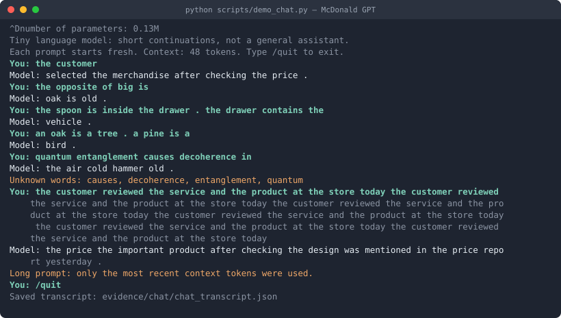

# McDonald GPT — Class 4: Building a Custom LLM

Training a 112,000-parameter nanoGPT from scratch on a classroom corpus, then measuring
it against a fixed 48-case language eval suite before and after training — four times, on
the starter corpus and on three different corpus extensions.

**Repository:** https://github.com/greycatallen/mcdonald-gpt
**Model:** Andrej Karpathy's nanoGPT (`nanogpt_model.py`, pinned to upstream commit
`3adf61e154c3fe3fca428ad6bc3818b27a3b8291`, SHA-256 verified by the notebook at runtime).
No API keys, no pretrained weights, no other model. CPU only.

> ### Status
>
> Nothing in this README is estimated, predicted-as-actual, or copied from the reference
> run shipped in the upstream repo. Every number came out of a run in this repository and
> links to the file it came from.
>
> | Stage | State |
> |---|---|
> | Pipeline smoke test (10 steps) | ✅ [`evidence/smoke-10-steps/`](evidence/smoke-10-steps/) |
> | Prediction written and locked | ✅ commit `16faf8e`, before any graded run |
> | Experiment 1: starter corpus | ✅ [`evidence/experiment1-starter/`](evidence/experiment1-starter/) |
> | Experiment 2: + McDonald's filings | ✅ [`evidence/experiment2-mcdonalds/`](evidence/experiment2-mcdonalds/) |
> | Experiment 3: + category-targeted material | ✅ [`evidence/experiment3-targeted/`](evidence/experiment3-targeted/) |
> | Experiment 3b: + three missing word forms | ✅ [`evidence/experiment3b-targeted-v2/`](evidence/experiment3b-targeted-v2/) |
> | Chat transcript (6 real interactions) | ✅ [`evidence/chat/`](evidence/chat/) |
> | Conceptual write-ups (in my own words) | ⬜ **outstanding — §11, mine to write** |
>
> ### Headline result
>
> | Experiment | Corpus | Correct / 48 | Coverage |
> |---|---|---:|---:|
> | 1 | starter only | 20 | 50.0% |
> | 2 | **+ 45 MB of McDonald's filings** | **3** ⬇ | **8.3%** ⬇ |
> | 3 | + 0.06 MB of targeted material | 29 ⬆ | 68.8% ⬆ |
> | 3b | + three more word forms | **32** ⬆ | **75.0%** ⬆ |
>
> Adding ~750× more text made the model **much worse**. Adding a tiny amount of
> task-matched text made it better. Details in §8 and §9.

---

## 1. Overview

This is the Class 4 assignment: choose a corpus, training steps, and a learning rate; train
a tiny word-token transformer; test it on an eval suite that is deliberately kept out of the
training data; and talk to the result through a chat interface.

The model is small enough to inspect completely. Two transformer blocks, four attention
heads, 64-dimensional embeddings, a 48-token context window, trained with AdamW using
warmup and cosine decay. At the starter vocabulary size of 136 word types that is
**111,872 parameters** — roughly one millionth of a frontier model.

The point is not to build a capable chatbot. It is to be able to point at a specific token
ID, a specific 64-number vector, a specific gradient, and a specific weight update, and
explain how they connect.

---

## 2. How to open and run

### Local (what was actually used here)

```bash
git clone https://github.com/greycatallen/mcdonald-gpt.git
cd mcdonald-gpt
python3 -m venv .venv
./.venv/bin/pip install -r requirements.txt numpy
```

`numpy` is installed explicitly: `run_evals.py` hashes model weights via
`tensor.numpy()`, which fails with `RuntimeError: Numpy is not available` on a
torch-only environment. This is the one setup deviation from the upstream instructions.

Then open `custom_llm.ipynb` in Jupyter or VS Code against `.venv`, set the three choices
in Section 1, and Run All.

### Google Colab

Open `custom_llm.ipynb` in Colab; the default CPU runtime is enough. Run Sections 1–2 once
to create `/content/corpus`, upload extension files into that folder via the Files sidebar,
then Run All. Opening a notebook from GitHub does **not** copy this repository's folders.

### Reproducing a run headlessly

[`scripts/run_experiment.py`](scripts/run_experiment.py) sets the three choices and executes
the notebook with outputs preserved:

```bash
./.venv/bin/python scripts/run_experiment.py custom_llm.ipynb notebooks/out.ipynb classroom 3000 0.001 "the customer"
```

### Verifying the eval suite was never modified

```bash
shasum -a 256 evals/language_evals.json
# e8affcd72841e3ed7da5c0b6b116327fe9f69c9abd66a1180d1d88ceaa3e17f7
```

This matches the hash pinned inside the notebook's own setup cell and the upstream
repository, so the 48 cases are provably unchanged across every run below.

---

## 3. My three choices and my reasons

| Choice | Value | Reason |
|---|---|---|
| Corpus | Experiment 1: `classroom` (starter only) · Experiment 2: `classroom` + McDonald's financial statements and CEO letters · Experiment 3: `classroom` + material targeted at ≥2 eval categories | Three runs, because "does adding data help?" and "does adding *task-matched* data help?" are different questions and a single extension run cannot separate them. |
| Training steps | 3000 | The notebook's designated main-experiment budget (`# 10 for setup; 3000 for the main experiment`) ≈ 23 passes over the corpus at batch size 32. A 10-step smoke test was run first and is reported below as a null result. Runtime is ~8 s, so the budget was not chosen to save time — it was chosen to be comparable to the reference configuration. |
| Learning rate | 0.001 | The standard AdamW default and well-matched to a 112k-parameter model. Held **identical across all three experiments** so that any difference between them is attributable to the corpus, not the optimizer. |

**On the learning rate specifically** — why too large or too small is a problem: the learning
rate scales every weight update. Too large and the optimizer overshoots the minimum it is
descending toward; the loss curve goes jagged or diverges outright. Too small and each update
barely moves the weights, so the model is still underfit when the step budget runs out. The
notebook applies warmup then cosine decay on top of the value set here, so this is the
*peak* rate, not a constant one.

### Pipeline smoke test (10 steps) — a real, documented null result

Before the graded run, the pipeline was validated end-to-end at `TRAINING_STEPS = 10`, the
value the notebook labels `# 10 for setup`. The whole notebook completed in **7.9 seconds**
with no errors. It also learned essentially nothing, which is the expected and correct
outcome:

| Stage | Correct / 48 | Scorable / 48 | Accuracy among scorable | Coverage |
|---|---|---|---|---|
| Untrained | 9 | 24 | 37.5% | 50% |
| Trained (10 steps) | 9 | 24 | 37.5% | 50% |

Loss moved 4.926 → 4.208. Uniform-guess loss for a 136-word vocabulary is
ln(136) = **4.913**, so after 10 steps the model was still close to a random guesser. The
overall eval score did not move at all; the only change was noise redistributing between
groups (`starter_patterns` 6→5, `starter_transfer` 3→4).

This run is kept deliberately, as evidence that the harness works and that a 10-step budget
is not a training budget. Full output: [`evidence/smoke-10-steps/`](evidence/smoke-10-steps/).

---

## 4. My prediction, written before training

> Committed in this repository **before any graded run**, and not edited afterward. Git
> history is the timestamp: this section was committed at the tip named in §6, before the
> Experiment 1 commit that follows it.

### My prediction (Allen)

**P1. Adding new training material will significantly improve the evaluation results.**

**P2. Training on McDonald's financial statements and CEO letters to consumers will be
enough, on its own, to produce that significant improvement.**

My reasoning: the starter corpus is small and narrow. Real business prose is far larger and
more varied than synthetic classroom sentences, so a model trained on it should have more
language to draw on and should therefore do better on a general language test.

**What counts as "significant", agreed before the run:** an increase of **at least 5 cases
out of 48** in all-case success over the Experiment 1 trained baseline. Anything smaller is
noise at this scale — a single case is 2.1 percentage points.

### Recorded disagreement (assistant), before the run

I expect **P2 to be falsified**, and I am recording why in advance so the comparison is
honest rather than reconstructed afterward:

1. The 24 `extend_corpus` cases need words like `salmon`, `robin`, `freezes`, `opposite`,
   `lent`, `thanked`, `cold`, `ice`, `blue`. None of these occur in a 10-K or a shareholder
   letter, so those cases should stay **out of vocabulary and score 0**.
2. The tokenizer keeps only the **509 most frequent training token types**. Financial
   vocabulary competes for those slots, so adding a large off-topic corpus can *evict*
   starter words and **reduce** coverage — making the score go **down**, not up.
3. Therefore I expect Experiment 3 (task-matched material) to beat Experiment 2
   (more, off-topic material), even though Experiment 2 adds far more text.

If P1/P2 hold and this is wrong, that is the more interesting result and it gets reported
as plainly as the reverse.

### Shared predictions for Experiment 1 (starter corpus)

| # | Claim | Committed value |
|---|---|---|
| 1 | Validation loss falls from ~4.93 | to **1.6 – 2.2** |
| 2 | Train/validation gap stays small — **no real overfitting**, because both splits come from the same template generator | gap **< 0.2** |
| 3 | `extend_corpus` cannot improve — the words are absent from the vocabulary | **0 / 24, 0% coverage** |
| 4 | `starter_patterns` improves substantially | 37.5% → **60 – 85%** |
| 5 | `starter_transfer` improves less, since it reuses known words in new sentence shapes | 37.5% → **40 – 60%** |
| 6 | Overall, hard-capped at 24/48 by out-of-vocabulary cases | **14 – 19 / 48** |
| 7 | `customer`'s nearest neighbours become its slot-mates, not its synonyms | `shopper`, `client`, `buyer`, `consumer`, `subscriber` |

Claim 7 is the conceptual one: these vectors encode **interchangeability in context**, not
meaning. The model should learn that `customer` and `shopper` are similar because they fill
the same blank — never because it knows what a customer is.

Generated text should go from word salad at step 0 to locally grammatical but semantically
repetitive template sentences. Temperature should trade repetition for variety, and **no
weights should change during generation**.

*Note on method: the upstream repo ships `examples/reference/history.json`, a reference run
at this exact configuration. It was deliberately not opened before these numbers were
committed, so these are predictions rather than lookups.*

### Scorecard: Experiment 1 predictions vs. measured results

**Three of seven claims were wrong.** They are reported here first, before the results
that were right.

| # | Claim | Predicted | Measured | Verdict |
|---|---|---|---|---|
| 1 | Validation loss | 1.6 – 2.2 | **0.706** | ❌ **Wrong** — loss fell far further than expected |
| 2 | Train/val gap (no overfitting) | < 0.2 | **0.028** | ✅ Correct |
| 3 | `extend_corpus` | 0/24, 0% coverage | **0/24, 0% coverage** | ✅ Correct |
| 4 | `starter_patterns` | 60 – 85% | **100%** (16/16) | ❌ **Wrong** — exceeded the range |
| 5 | `starter_transfer` | 40 – 60% | **50%** (4/8) | ✅ Correct |
| 6 | Overall | 14 – 19 / 48 | **20 / 48** | ❌ **Wrong** — by one case |
| 7 | `customer`'s neighbours | `shopper`, `client`, `buyer`, `consumer`, `subscriber` | **exactly those five** | ✅ Correct |

### Scorecard: the McDonald's hypothesis (P1 / P2)

**P2 was falsified, and in the opposite direction from the one predicted.**

| | Predicted | Measured |
|---|---|---|
| P2: McDonald's material alone produces a significant gain (≥ +5 / 48) | 20 → **25 or better** | 20 → **3** |

Adding 45 MB of McDonald's annual reports and CEO letters did not improve the score by five
cases; it **removed 17 of the 20 the starter model was getting right**. The mechanism is
documented with measurements in §9 — the short version is that the vocabulary is capped at
509 types, financial prose flooded it, and 39 starter words were evicted, so cases the model
used to answer became unreadable to it.

**P1 — "adding new training material will significantly improve the evaluation results" — is
half right, and the half that is wrong is the interesting half.** Adding material helped when
it matched the task (Experiment 3: 20 → 29) and hurt badly when it did not (Experiment 2:
20 → 3). It is not the *amount* of new material that mattered. Experiment 3 added roughly
**0.13%** as much text as Experiment 2 and beat it by 26 cases.

**What I got wrong and why.** Claims 1, 4 and 6 all failed in the same direction: I badly
underestimated how learnable the starter corpus is. It is generated from a small set of
sentence templates, so once the model has the templates there is very little residual
uncertainty — validation loss reached 0.706 rather than the predicted 1.6–2.2, and
`starter_patterns` saturated at a perfect 16/16 instead of the predicted 60–85%. Claim 6
then failed as an arithmetic consequence of claim 4 being wrong, missing by a single case.
The lesson is that I was reasoning about "a tiny model on a small corpus" when the binding
constraint was actually **how repetitive the corpus is**, not how small the model is.

Claim 2 was the deliberately contrarian one, and it held: the gap was 0.028, not the
textbook overfitting divergence. Claim 7 held precisely, which is covered in §7.

---

## 5. The corpus

### Sources and permissions

Full detail, with per-file SHA-256 hashes, page counts and extraction warnings:
**[`docs/corpus-sources.md`](docs/corpus-sources.md)**

| Corpus | Source | Published here? |
|---|---|---|
| Starter | The notebook's own generated classroom sentences | n/a — generated at runtime |
| McDonald's | 13 public investor-relations PDFs: annual reports (SEC Form 10-K) 2016–2025 and CEO letters to shareholders, ~45 MB, ~800 pages | **Yes**, at [`corpus_sets/mcdonalds/`](corpus_sets/mcdonalds/) |
| Targeted | Synthetic teaching sentences written for this assignment by [`scripts/build_targeted_corpus.py`](scripts/build_targeted_corpus.py) | **Yes**, at [`corpus_sets/targeted/`](corpus_sets/targeted/) |

The McDonald's documents are McDonald's own publicly distributed filings, available from SEC
EDGAR and the company's investor-relations site. They contain no personal or confidential
data. They are third-party copyrighted material redistributed here as public company filings
so the run is reproducible. The targeted material is entirely self-authored.

Upstream git-ignores all of `corpus/` to prevent accidental publication; this repo
deliberately publishes both corpus sets so a grader can read exactly what each model trained
on — see [`.gitignore`](.gitignore).

### PDF extraction check

All 13 PDFs contained selectable text, so no OCR was needed and no file was dropped.
**Four page-level warnings were raised across three files**, and each was opened individually
with `pypdf` to check rather than assumed:

| File | Page | Finding |
|---|---|---|
| `2020 Annual Report.pdf` | 98 | 0 characters, **12 images** — graphical back cover, not a blank page. Its text, if any, is inside the images and would need OCR. |
| `MCD 2025 Annual Report.pdf` | 2 | 0 characters, 0 images — genuinely blank |
| `MCD 2025 Annual Report.pdf` | 85 | 0 characters, 0 images — genuinely blank |
| `McDonalds_2018_Annual_Report_unlocked.pdf` | 25 | 0 characters, 0 images — genuinely blank |

Three are truly blank; one is image-only. That is one page of cover art lost out of ~800
ingested — immaterial to a word-frequency vocabulary. Reading order was checked by confirming
each file's preview in `corpus_manifest.json` begins with the expected SEC Form 10-K cover
page rather than scrambled text.

**One file needed intervention.** `McDonalds_2018_Annual_Report.pdf` carries an owner-password
flag and the notebook refuses encrypted files outright. It has **no user password** — `pypdf`
opens it with an empty string, so nothing was bypassed or guessed; the flag only restricts
printing and editing in viewers. Following the error message's own instruction ("export an
unlocked copy you are allowed to use"), the pages were re-saved unlocked and verified
identical (94 pages, 3,696 characters on page 1).

No PDFs are used, so there is no PDF extraction to verify and no extraction warnings to
resolve. If that changes, the check is to read the extracted text back out of the saved
`corpus.txt` and the previews in `corpus_manifest.json` rather than trusting the file count.

### Measured corpus facts

| | Exp 1 (starter) | Exp 2 (+ McDonald's) | Exp 3 (+ targeted) | Exp 3b (+ word forms) |
|---|---|---|---|---|
| Corpus folder | `corpus_sets/starter` | `corpus_sets/mcdonalds` | `corpus_sets/targeted` | `corpus_sets/targeted_v2` |
| Files ingested | **0** | **13** | **4** | **5** |
| Vocabulary size | **136** | **512** (at cap) | **466** | **482** |
| Training unknown rate | **0.00%** | **13.40%** | **0.00%** | **0.00%** |
| Held-out unknown rate | **0.00%** | **13.63%** | **0.22%** | **0.36%** |
| Train / validation | **4132 / 460** | **36750 / 4084** | **4419 / 491** | **4429 / 493** |
| Reserved eval passages | **160** | **160** | **160** | **160** |

Experiment 1's vocabulary is only 136 types — far under the 509 cap — because the starter
corpus contains no more distinct words than that. **The cap does not bind in Experiments 1,
3 or 3b. It binds hard in Experiment 2**, whose vocabulary saturates at 512 and whose
unknown-token rate jumps from 0% to 13.4%. That is the mechanism behind §9's result: once
the cap binds, adding a word means *removing* a different one.

**Why each experiment has its own corpus folder.** `CORPUS = "classroom"` means *classroom
sentences **plus** every ingestible file in `CORPUS_FOLDER`.* The McDonald's PDFs were
initially placed in the default `corpus/` folder, which would have silently added ~46 MB of
financial prose to the "starter-only" baseline and invalidated the comparison. Each run now
points at an isolated folder under `corpus_sets/`, and the runner prints the ingestible file
count at the top of every execution so contamination is visible rather than assumed.
Experiment 1's log reads `corpus folder : corpus_sets/starter (0 ingestible file(s))`.

Links: `corpus_manifest.json` · `vocabulary_report.json` (per experiment, under `evidence/`).

The tokenizer keeps only the **509 most frequent training token types**; everything else
becomes `<UNK>`. The split is by short passage, not by source file — which limits what the
held-out set can actually test, since two passages from the same template generator can land
on opposite sides of the split and look nearly identical.

---

## 6. What actually happened

| | Exp 1 | Exp 2 | Exp 3 | Exp 3b |
|---|---|---|---|---|
| Completed steps | 3000 / 3000 | 3000 / 3000 | 3000 / 3000 | 3000 / 3000 |
| Training time | **13.4 s** | **27.5 s** | **13.4 s** | **14.1 s** |
| Notebook wall clock | 21.8 s | 67.0 s | 19.6 s | 19.9 s |
| Parameters | **111,872** | **135,936** | **132,992** | **134,016** |
| Run folder | `…T204453_348548Z` | `…T205000_299088Z` | `…T205313_630391Z` | `…T205838_143591Z` |
| Interrupted / failed? | No | No | **Yes — first attempt** (see below) | No |

Hardware for all runs: **macOS 26.6.2, arm64 (Apple Silicon), CPU only**, PyTorch 2.14.0,
Python 3.12.14. Parameter counts differ only because the embedding table scales with
vocabulary size; the architecture (2 layers, 4 heads, 64-dim, 48-token context) is identical
everywhere, as is the seed (42), batch size (32), step count and learning rate.

Executed notebooks: [Exp 1](notebooks/experiment1-starter.executed.ipynb) ·
[Exp 2](notebooks/experiment2-mcdonalds.executed.ipynb) ·
[Exp 3](notebooks/experiment3-targeted.executed.ipynb) ·
[Exp 3b](notebooks/experiment3b-targeted-v2.executed.ipynb)

### Failures and interruptions, stated plainly

Nothing was interrupted, but three things went wrong during setup and are recorded rather
than quietly fixed:

1. **Evals crashed on a torch-only install.** `RuntimeError: Numpy is not available`, raised
   from `run_evals.py:80` where `model_hash()` calls `tensor.numpy()`. `numpy` is missing
   from `requirements.txt`. Fixed by installing it; documented in §2.
2. **An encrypted PDF stopped the whole import.** `McDonalds_2018_Annual_Report.pdf` raised
   `Could not import ...: encrypted PDF; export an unlocked copy you are allowed to use`.
   One bad file aborts the entire corpus load, not just that file. See §5.
3. **The starter baseline was nearly contaminated.** The McDonald's PDFs were sitting in the
   default `corpus/` folder while `CORPUS = "classroom"`, which would have folded them into
   the "starter-only" run. Caught only because failure (2) aborted the run first. Fixed
   structurally by giving each experiment its own corpus folder.
4. **Experiment 3 failed its first run by leaking eval prompts into the training corpus.**
   This is the most serious of the four and is reported in full rather than quietly fixed.
   The first draft of the teaching material contained three sentences that began with an
   exact eval prompt:

   ```
   ValueError: Could not import everyday_knowledge.txt: Eval leakage in
   everyday_knowledge.txt: lang_43, lang_44, lang_45.
   Remove the exact test prompts. Write different teaching examples.
   ```

   | Case | Eval prompt | What had been written |
   |---|---|---|
   | `lang_43` | `water freezes into` | `water freezes into ice when the air is cold .` |
   | `lang_44` | `a person uses an umbrella to stay` | `a person uses an umbrella to stay dry in the rain .` |
   | `lang_45` | `to see in a dark room we turn on a` | `to see in a dark room we turn on a light .` |

   The notebook's guard refused to train, so **no contaminated model was ever produced and no
   contaminated result is reported anywhere in this repository.** The sentences were rewritten
   to teach the same facts in different words, and
   [`scripts/check_leakage.py`](scripts/check_leakage.py) was added to audit *every* corpus
   file against *all 48* cases before training — the notebook aborts on the first offending
   file, so a single clean run does not prove the rest are clean. All corpus sets now report
   `CLEAN`.

---

## 7. Evidence

### Loss curves — Experiment 1


Complete measured values from [`history.json`](evidence/experiment1-starter/history.json):

| Step | Training panel loss | Validation panel loss | Gap |
|---:|---:|---:|---:|
| 0 | 4.9263 | 4.9275 | 0.0012 |
| 1500 | 0.6821 | 0.7182 | 0.0361 |
| 3000 | 0.6783 | 0.7061 | 0.0278 |

These are **fixed evaluation panels**: at most 20 training documents and 20 validation
documents, the same ones at every measurement, reduced as the mean over non-padding
next-token targets. They are not a full-corpus loss.

**Reading these numbers.** Step 0's loss of 4.9263 is not arbitrary — uniform guessing over
a 136-word vocabulary costs exactly ln(136) = **4.913**. The model starts as a random
guesser, by construction. By step 3000 it reaches 0.678/0.706.

**The validation gap never opens.** It is 0.036 at step 1500 and *narrows* to 0.028 by step
3000 — the validation curve tracks the training curve rather than turning upward. This
confirms prediction 2, and the reason matters: the split is by passage from the same template
generator, so held-out passages look almost exactly like training passages. **This is a weak
held-out set.** It demonstrates the model did not memorize specific passages, but it cannot
show generalization to genuinely new language — which is precisely what the `starter_transfer`
and `extend_corpus` eval groups are for, and where the model does much worse.

Almost all learning happens before step 1500: loss falls 4.93 → 0.68 in the first half, then
moves 0.0038 across the entire second half. Most of the 3000-step budget was spent going
nowhere.

### Text samples: untrained, halfway, final

Identical generation settings at all three points. Full files:
[`step_0000.txt`](evidence/experiment1-starter/samples/step_0000.txt) ·
[`step_1500.txt`](evidence/experiment1-starter/samples/step_1500.txt) ·
[`step_3000.txt`](evidence/experiment1-starter/samples/step_3000.txt)

**Step 0 (untrained):**
```
pear professor bond doctor course harvest team physician journey checking buyer delivery
traffic report the lecturer item offering and system <UNK> taste recommended mentioned bus
question customer at mortgage nurse in instructor
```

**Step 1500 (halfway):**
```
our school has a question about the new educator and lesson .
a review of risk helped us understand the different deposit .
we learned about the important website during a discussion of data .
```

**Step 3000 (final):**
```
our school has a question about the new educator and lesson .
a review of risk helped us understand the different deposit .
the report about the nurse explains the health in detail .
the consumer compared the offering after checking the price .
```

**The visible change** is between step 0 and step 1500, and it is total: word salad with no
grammar, no sentence boundaries and a stray `<UNK>` becomes grammatical sentences with
correct article/noun/verb order and terminating periods.

**The equally important lack of change** is between 1500 and 3000: the first two lines are
*identical, word for word*. Only lines 3–4 differ. This is the sample-level counterpart of
the loss curve flattening — the second half of the training budget bought almost nothing.

### Token → ID → vector, and one real weight update

Files: [`tokenization.json`](evidence/experiment1-starter/tokenization.json) ·
[`inspection.json`](evidence/experiment1-starter/inspection.json)

The probe word is **`customer`**, token ID **28**.

**Its 64-number vector, first coordinate:** `-0.057592` before training → `+0.036634` after.
The word is not stored as text anywhere in the network; it is this row of 64 numbers.

**One real gradient and weight update** (the first optimizer step, coordinate 0):

| | Value |
|---|---|
| Weight before | `-0.057591915130615234` |
| Gradient | `+0.000692586530931294` |
| Learning rate at this step | `0.00001` (warmup — not the 0.001 peak) |
| Weight after | `-0.057601906359195710` |

The update is `-0.05759192 - (0.00001 × 0.00069) ≈ -0.05760191`. It moved the weight by about
**one hundred-thousandth**. A single step is essentially invisible; the visible change comes
from 3000 of them compounding. Note the learning rate here is 1e-05, not the configured
0.001, because the notebook applies **warmup** — the rate ramps up before cosine decay.

**Next-token probabilities for the prefix `the customer`:**

| Before training | | After training | |
|---|---:|---|---:|
| `customer` | 1.60% | `reviewed` | 17.82% |
| `bus` | 1.07% | `recommended` | 17.12% |
| `educator` | 1.04% | `ordered` | 16.85% |
| `us` | 1.03% | `selected` | 16.34% |
| `application` | 1.01% | `compared` | 15.97% |
| `course` | 0.98% | `returned` | 14.28% |

Before training the distribution is essentially flat — every word gets ~1/136 ≈ 0.74%, and
the top pick is the nonsensical `the customer customer`. After training, **98.4% of the
probability mass sits on six words, and all six are verbs a customer can perform.** The model
learned the *grammatical slot*, not the meaning of "customer".

**Neighbours of `customer` in embedding space** (cosine similarity over the full 64
dimensions):

| Before training | | After training | |
|---|---:|---|---:|
| `bus` | 0.213 | `shopper` | **0.978** |
| `educator` | 0.203 | `client` | **0.977** |
| `helped` | 0.202 | `buyer` | **0.977** |
| `bank` | 0.201 | `subscriber` | **0.971** |
| `risk` | 0.198 | `consumer` | **0.970** |
| `selected` | 0.191 | `team` | 0.503 |

Before training these are random initialization noise — `bus` and `helped` sit near
`customer` for no reason, all at ~0.2. After training the top five are exactly the five words
predicted in §4, all above 0.97, and then a **cliff to 0.503**. The model discovered that
`customer`, `shopper`, `client`, `buyer`, `subscriber` and `consumer` are interchangeable —
not because it knows what a customer is, but because they fill the same blanks. That
distinction is the single most important thing this run demonstrates.

### Temperature comparison

[`temperature_comparison.json`](evidence/experiment1-starter/temperature_comparison.json)

| Temperature | Fourth sampled line |
|---|---|
| 0.3 | `the local consumer was mentioned in the purchase report yesterday .` |
| 0.8 | `the consumer compared the offering after checking the price .` |
| 1.2 | `the consumer compared the offering after checking the price .` |

The first three lines are **identical at all three temperatures**; only the fourth differs,
and 0.8 and 1.2 produce the same text. This is a weaker temperature effect than expected,
and it follows directly from the probability table above: when six words split 98% of the
mass almost evenly (17.8% vs 14.3%), flattening or sharpening that distribution rarely
changes which one gets drawn. Temperature has little to work with when the model is this
confident and the corpus this templated.

**No weights changed during any of this.** Temperature is applied at sampling time, dividing
the logits before the softmax. The same trained network produced all three columns.

---

## 8. The 48-case language evals

The suite lives at [`evals/language_evals.json`](evals/language_evals.json) and is byte-identical
to upstream (hash above). The runner is [`run_evals.py`](run_evals.py), which performs inference
and scoring only — it never trains.

### How scoring works

1. Only the **prefix** is fed to the model. Answers and answer choices are never in the prompt.
2. The four candidate words' next-token probabilities are compared; highest wins. Correct = 1,
   incorrect or tied = 0. Random guessing averages 25%.
3. Separately, an **unconstrained continuation** is generated at temperature 0.8 with a fixed
   per-case seed and a 24-token cap. This free text is saved but **is not what the
   multiple-choice score grades.**
4. If any word in the prompt or choices is outside the learned vocabulary, the case is marked
   `out_of_vocabulary` and scores zero — no lucky credit for comparing identical `<UNK>` tokens.

This is why three different numbers get reported, and they answer different questions:

- **All-case success (/48)** — the honest headline. Missing coverage counts as zero, so you
  cannot inflate it by dropping hard cases.
- **Accuracy among scorable cases** — how well the model does on questions it *could* answer.
  This can move simply because coverage changed, so it must be read next to coverage.
- **Vocabulary coverage** — what fraction of cases the model had the words for at all. This is
  a property of the corpus, not of the model's reasoning.

### Required four-row comparison

| Experiment | Stage | Correct / 48 | Scorable / 48 | Accuracy among scorable | Coverage | Full results |
|---|---|---|---|---|---|---|
| 1. Starter corpus | Untrained | 9 (18.75%) | 24 | 37.50% | 50.0% | [untrained/](evidence/experiment1-starter/language_evals/untrained/) |
| 1. Starter corpus | **Trained** | **20 (41.67%)** | 24 | **83.33%** | 50.0% | [final/](evidence/experiment1-starter/language_evals/final/) |
| 2. + McDonald's | Untrained | 1 (2.08%) | 4 | 25.00% | 8.3% | [untrained/](evidence/experiment2-mcdonalds/language_evals/untrained/) |
| 2. + McDonald's | **Trained** | **3 (6.25%)** | 4 | 75.00% | **8.3%** | [final/](evidence/experiment2-mcdonalds/language_evals/final/) |
| 3. + targeted | Untrained | 4 (8.33%) | 33 | 12.12% | 68.8% | [untrained/](evidence/experiment3-targeted/language_evals/untrained/) |
| 3. + targeted | **Trained** | **29 (60.42%)** | 33 | **87.88%** | 68.8% | [final/](evidence/experiment3-targeted/language_evals/final/) |
| 3b. + word forms | Untrained | 12 (25.00%) | 36 | 33.33% | 75.0% | [untrained/](evidence/experiment3b-targeted-v2/language_evals/untrained/) |
| 3b. + word forms | **Trained** | **32 (66.67%)** | 36 | **88.89%** | **75.0%** | [final/](evidence/experiment3b-targeted-v2/language_evals/final/) |

**Read the three columns against each other — they tell different stories.**

Compare Experiment 2 trained (3/48, but **75% accuracy among scorable**) with Experiment 1
trained (20/48, 83% among scorable). Experiment 2's scorable accuracy looks respectable only
because there were **4 scorable cases left**. Judging it on that column alone would hide a
catastrophic regression. The all-case column is the honest one precisely because missing
coverage scores zero there.

Note also that the untrained scores differ across experiments (9, 1, 4, 12). Untrained models
are random, but they are not the *same* random — vocabulary size differs, so the models differ
in shape and their random guesses land differently. **Untrained scores are not a fixed
baseline across experiments**, which is why each experiment carries its own.

### Loss is not comparable across experiments

| Experiment | Val loss at step 0 | Final val loss | Final train loss | Gap |
|---|---:|---:|---:|---:|
| 1 | 4.9275 | **0.7061** | 0.6783 | +0.0278 |
| 2 | 6.2402 | **2.1520** | 2.4623 | −0.3103 |
| 3 | 6.1336 | **0.7095** | 0.7306 | −0.0211 |
| 3b | 6.1667 | **0.7561** | 0.7438 | +0.0124 |

Experiment 2's final loss (2.15) is ~3× Experiment 1's (0.71), but these numbers **cannot be
compared directly**: cross-entropy is measured over different vocabularies, and starting loss
alone differs (ln 136 = 4.91 vs ln 512 = 6.24). A model predicting among 512 options faces a
harder problem than one predicting among 136. This is exactly the "losses across different
corpora are not a class ranking" warning in the brief.

In Experiments 2 and 3 the validation loss sits *below* training loss (negative gap). That is
not a bug — the fixed panels hold at most 20 documents each, so which 20 you happen to draw
matters more than any generalization signal at this scale.

Training moved the starter model from 9 to 20 correct out of 48. Read that carefully: the
all-case rate went 18.75% → 41.67%, but the accuracy *among cases it could answer* went
37.50% → **83.33%**. The two numbers differ because **coverage stayed frozen at exactly 50%**
— training cannot add words to the vocabulary, so the 24 out-of-vocabulary cases were
unanswerable before and remain unanswerable after.

### Breakdown by group — Experiment 1

| Group | Untrained | Trained | Scorable | Coverage |
|---|---|---|---|---|
| `starter_patterns` | 6/16 (37.5%) | **16/16 (100%)** | 16 | 100% |
| `starter_transfer` | 3/8 (37.5%) | **4/8 (50%)** | 8 | 100% |
| `extend_corpus` | 0/24 | **0/24** | 0 | **0%** |

### Breakdown by category — Experiment 1

| Category | Untrained | Trained | Coverage |
|---|---|---|---|
| `domain_context` | 3/8 | **8/8** | 100% |
| `domain_place` | 3/8 | **8/8** | 100% |
| `new_wording` | 3/8 | **4/8** | 100% |
| `grammar` | 0/3 | 0/3 | 0% |
| `opposites` | 0/3 | 0/3 | 0% |
| `negation` | 0/3 | 0/3 | 0% |
| `reference` | 0/3 | 0/3 | 0% |
| `sequence` | 0/3 | 0/3 | 0% |
| `spatial_relations` | 0/3 | 0/3 | 0% |
| `everyday_knowledge` | 0/3 | 0/3 | 0% |
| `categories_and_analogies` | 0/3 | 0/3 | 0% |

**What worked:** the two pure association categories saturated at 8/8. These are exactly what
the starter corpus drills — `customer`→`service`, `surgeon`→`patient`.

**What did not:** `new_wording` reached only 4/8. **This is the most informative result in
the experiment.** Those cases use the *same vocabulary the model has mastered*, rearranged
into unfamiliar sentence shapes. The model scores 100% on familiar templates and 50% — coin
flip — the moment the phrasing changes. It learned templates, not the associations
underneath them. Every zero below `new_wording` is a 0% coverage row, not a reasoning
failure.

### Actual free continuations — different from the multiple-choice score

These are unconstrained generations at temperature 0.8, saved regardless of quality. The
multiple-choice score does **not** grade them.

| Case | Prompt | Untrained continuation | Trained continuation |
|---|---|---|---|
| `lang_01` | `the report about the customer explains the` | `pear professor item doctor course harvest team physician journey checking buyer delivery our report the lecturer item offering and system <UNK> taste recommended payment` | `service in detail .` |
| `lang_17` | `our hospital discussed the nurse and the` | `customer order bank taste` | `health at the hospital .` |
| `lang_25` | `one bird` | `deposit a office car new client we quality selected mango harvest about about student team hospital merchandise client helped harvest discussion professor after discussed` | `the new customer with another client at the store .` |

`lang_25` is the case worth studying. The model scores **0** on it — `bird`, `one` and all
four choices (`is`, `are`, `were`, `am`) are outside the 136-word vocabulary, so it is marked
`out_of_vocabulary`. Yet its free continuation is a **fluent, grammatical English sentence**.

That gap is the entire argument for reporting both numbers. Judging this model by its free
text would suggest it understands the prompt; it cannot even represent the words in it. The
fluent output is the model ignoring an unreadable prompt and emitting a generic
high-probability sentence. Coverage is what exposes this, and a free-text demo would hide it.

### Keeping the exam out of the textbook

`eval_separation.json`: [Exp 1](evidence/experiment1-starter/eval_separation.json) ·
[Exp 2](evidence/experiment2-mcdonalds/eval_separation.json) ·
[Exp 3](evidence/experiment3-targeted/eval_separation.json) ·
[Exp 3b](evidence/experiment3b-targeted-v2/eval_separation.json)

**160 classroom passages were reserved before the split in every one of the four runs** —
identical across experiments, as expected, since they come from the same classroom generator.

Three independent layers kept the exam out of the textbook, and **one of them actually
fired**:

1. **Reservation.** Any generated classroom passage containing a test prefix is withheld
   before the train/validation split and before vocabulary building. 160 passages each run.
2. **Import rejection.** Imported files are scanned for exact test prefixes. **This caught a
   real leak** in the first Experiment 3 corpus (§6, failure 4) and refused to train.
3. **Location validation.** `validate_corpus_location()` refuses a corpus folder that is the
   repo root or contains `evals/`.

Added on top: [`scripts/check_leakage.py`](scripts/check_leakage.py), which audits every
corpus file against all 48 cases *before* a run, because the notebook aborts on the first
offending file and would not reveal whether the remaining files are clean.

```
$ python scripts/check_leakage.py corpus_sets/targeted_v2
clean categories_and_analogies.txt
clean everyday_knowledge.txt
clean opposites.txt
clean spatial_relations.txt
clean word_forms.txt

RESULT: CLEAN - no eval prompt appears in any file
```

**Limits of this, stated plainly.** Every check above is a *normalized exact substring match*.
It normalizes case, punctuation spacing and whitespace, and nothing more. It does **not**
detect paraphrase, translation, semantic overlap, or a leaked answer list written in different
words. My own Experiment 3 leak was caught only because I had copied the prompts *verbatim*;
had I reworded them slightly while still teaching answer-by-answer, **every check would have
passed and the contamination would have been invisible.** Separation here rests on how the
material was written, not on the guard.

**Two honest qualifications about Experiment 3b.** First, the suite is public and was visible
while the corpus was written, so this is a **fixed development benchmark, not an unseen final
test**. Second, and more specifically: Experiment 3b exists *because* Experiment 3's eval
output told me which three word forms were missing. That is legitimate iteration and the
brief anticipates it — but it means 3b's score is partly a measure of how well I read a
coverage report, not purely of how well the model generalizes. A claim about unseen
generalization would need new cases that guided none of these choices. **No such claim is
made here.**

The notebook reserves any generated classroom passage containing a test prefix *before* the
train/validation split and before vocabulary building, rejects exact test prefixes in imported
files, and refuses a corpus folder that contains `evals/` or the repo root.

**Limits of this check, stated plainly:** it normalizes case, punctuation spacing, and
whitespace, and catches *exact* prefix matches. It does **not** detect paraphrases, leaked
answer lists, or semantic contamination. Separation therefore depends on the extension
material being written independently, not just on the automated check passing.

**These are public development tests, not an unseen final benchmark.** They were visible while
the extension corpus was being written, so results here measure guided development, not
generalization to unseen data.

---

## 9. Corpus extension experiment

**Categories chosen: four taught, four deliberately left untaught as a control.**

| Taught (12 cases) | Control — untaught (12 cases) |
|---|---|
| `opposites`, `spatial_relations`, `everyday_knowledge`, `categories_and_analogies` | `grammar`, `negation`, `reference`, `sequence` |

**Why a control.** The assignment requires at least two categories. Teaching four and
withholding four turns the extension into a controlled comparison: if only the taught
categories gain coverage while the untaught ones stay at zero, the gain is attributable to
*task-matched material* rather than to simply adding more text. That is the claim
Experiment 2 alone could not test.

**What gap the material addresses.** A case is only scorable when **every word in its prompt
and all four answer choices** is in vocabulary. The starter corpus contains none of
`cold`, `full`, `quiet`, `below`, `inside`, `ice`, `steam`, `fish`, `goat`, `metal`. So the
24 extension cases were unanswerable — not "answered wrongly", but literally unreadable. The
material therefore has to introduce those words, **including the wrong answer choices**,
in ordinary sentences.

### Experiment 2: what 45 MB of off-topic text actually did

The vocabulary cap is the whole story. Experiment 2's vocabulary saturated at 512 types,
and **39 of the starter corpus's 136 words were evicted** to make room for financial prose:

```
apple, application, banana, bicycle, bond, bus, car, dentist, deposit, doctor,
educator, instructor, lecturer, loan, mango, merchandise, mortgage, nurse, orange,
ordered, peach, pear, physician, platform, professor, recommended, returned,
reviewed, route, selected, software, surgeon, taxi, teacher, therapist, train,
truck, tutor, website
```

Look at what is in that list: every medical role (`surgeon`, `nurse`, `doctor`, `physician`,
`dentist`, `therapist`), every teaching role (`teacher`, `professor`, `educator`,
`instructor`, `lecturer`, `tutor`), every fruit (`apple`, `banana`, `mango`, `orange`,
`peach`, `pear`) and every vehicle (`bus`, `car`, `taxi`, `train`, `truck`). **These are
precisely the words the `starter_patterns` cases are built from.** `customer` survived — it
is a business word — but `surgeon` did not, so `the report about the surgeon explains the …`
became unreadable to the model.

The result: `starter_patterns` coverage fell from 100% to 12.5%, and its score from 16/16 to
1/16. The model did not get worse at reasoning. It got worse at *seeing the question*.

This is the concrete answer to "does more data help?" — **at a fixed vocabulary budget,
off-topic data is not neutral. It is actively destructive**, because the budget is
zero-sum.

### Experiment 3 / 3b: what 0.06 MB of targeted text did

| Category | Exp 1 | Exp 3 | Exp 3b | Coverage 3b | |
|---|---|---|---|---|---|
| `opposites` | 0/3 (0% cov) | **3/3** | **3/3** | 100% | TAUGHT |
| `spatial_relations` | 0/3 (0% cov) | 2/3 | **3/3** | 100% | TAUGHT |
| `everyday_knowledge` | 0/3 (0% cov) | 0/3 (0% cov) | **2/3** | 100% | TAUGHT |
| `categories_and_analogies` | 0/3 (0% cov) | 1/3 | **0/3** | 100% | TAUGHT |
| `grammar` | 0/3 | 0/3 | 0/3 | **0%** | control |
| `negation` | 0/3 | 0/3 | 0/3 | **0%** | control |
| `reference` | 0/3 | 0/3 | 0/3 | **0%** | control |
| `sequence` | 0/3 | 0/3 | 0/3 | **0%** | control |
| `domain_context` | 8/8 | 8/8 | **8/8** | 100% | starter |
| `domain_place` | 8/8 | 8/8 | **8/8** | 100% | starter |
| `new_wording` | 4/8 | 7/8 | **8/8** | 100% | starter |

**The control worked exactly as designed.** All four untaught categories stayed at 0%
coverage and 0/3 across every run. Coverage is a property of the corpus, and text that never
mentions `walked`, `blue` or `finn` cannot make those cases readable no matter how long you
train.

**The unexpected result is `new_wording`: 4/8 → 8/8.** That group is *starter* material —
the same vocabulary the Experiment 1 model already had, rearranged into unfamiliar sentence
shapes, where Experiment 1 scored a coin-flip 50%. Nothing in the targeted corpus mentions
customers, surgeons or invoices. What it added was **structural variety**: sentences with
`if … then`, `when … the`, `X but Y`, multi-clause constructions the template-generated
starter corpus never produces. Exposure to varied sentence shapes improved performance on
*known words in new shapes* — the exact weakness §8 identified in Experiment 1. `starter_transfer`
as a whole went **4/8 → 8/8**, perfect.

That is the most useful finding here, and it was not predicted by anyone: the targeted corpus
helped most on a group it was not targeting.

### Experiment 3b: three words, +3 cases

Experiment 3 taught every *fact* the `everyday_knowledge` cases need and still scored 0/3 at
0% coverage. The per-case reports showed why — one missing word form each:

| Case | Missing word | The corpus had taught |
|---|---|---|
| `lang_43` | `freezes` | `freeze` |
| `lang_44` | `uses` | `opened`, `keeps` |
| `lang_45` | `turn` | `turned` |

**Word-level tokenization has no morphology.** `freeze` and `freezes` are two unrelated
integer IDs; knowing one tells the model nothing about the other. Experiment 3b added twelve
ordinary sentences using those three exact forms (`the lake freezes when winter arrives .`,
`she uses a spoon to eat her soup .`, `please turn the handle slowly .`), which lifted
`everyday_knowledge` from 0/3 to 2/3 and the overall score from 29 to 32.

**This was tuning guided by eval feedback**, which is why it is reported as a separate run
rather than merged into Experiment 3. See the honesty note at the end of §8.

### The failure that coverage cannot explain

`categories_and_analogies` has **100% coverage in Experiment 3b and still scores 0/3.** The
model has every word in `a robin is a bird . a salmon is a ___` and all four choices, and it
still picks wrong. Compare `opposites`, same treatment, 3/3.

This is a genuine reasoning failure, not a vocabulary gap, and it is the clearest limitation
in the whole project. The analogy cases require carrying a relation from the first clause
into the second — *A is-a B, therefore C is-a ?*. The corpus taught hundreds of `a X is a Y .`
statements, so the model learned the *pattern* `a <noun> is a <category>` and will happily
emit a plausible category; it did not learn to condition that category on the first clause.
The chat session shows it directly: `an oak is a tree . a pine is a` → **`bird .`** The shape
is right, the reasoning is absent.

**The teaching material:** [`corpus_sets/targeted/`](corpus_sets/targeted/) (Exp 3) and
[`corpus_sets/targeted_v2/`](corpus_sets/targeted_v2/) (Exp 3b), generated by
[`scripts/build_targeted_corpus.py`](scripts/build_targeted_corpus.py) — 2,142 sentences
across five files, all committed and readable.

The `the opposite of X is Y` frame is taught on **sixteen pairs the suite never tests**
(`big/small`, `wet/dry`, `near/far`, `clean/dirty`, …). The words the suite *does* test —
`hot`, `cold`, `empty`, `full`, `noisy`, `quiet` — are taught separately through ordinary
contrastive sentences (`the soup was hot but the water was cold .`), never as an answer list
and never in the suite's phrasing. Same approach for the other three categories.

Written as varied practice sentences, not one copied answer per test case. The eval prompts,
answer choices, answer key, scoring rules, eval outputs, and chat logs are never used as
training text or as a vocabulary source.

> **Gotcha worth recording.** `custom_llm.py:175` skips exactly one file — the top-level
> `corpus/README.md`. Every other `.md`, `.txt`, and `.pdf` under `corpus/`, *including in
> subfolders*, is ingested as training text. So there is deliberately **no README inside
> `corpus/extensions/`**: adding one would silently train the model on prose about the
> assignment. Documentation about the extension material lives in
> [`docs/`](docs/) and in this README instead, outside the corpus tree.

### Coverage, learned patterns, or both?

Separating the two is the point of reporting three numbers, and each experiment lands
differently:

| Change | Coverage effect | Learned-pattern effect |
|---|---|---|
| Exp 1 → Exp 2 (20 → 3) | **Almost entirely coverage.** 50% → 8.3%; 39 starter words evicted. | Minimal. Scorable accuracy actually *rose* (83% → 75% on a 4-case base — too small to read). The model did not forget how to answer; it lost the ability to read the questions. |
| Exp 1 → Exp 3 (20 → 29) | **Large.** 50% → 68.8%, +9 scorable cases from new vocabulary. | **Also real.** `new_wording` 4/8 → 7/8 with *no* coverage change — same words, same 100% coverage, better answers. That is a learned-pattern gain. |
| Exp 3 → Exp 3b (29 → 32) | **Entirely coverage.** Three word forms, +3 scorable cases. | None claimed. Taught categories otherwise unchanged. |

The cleanest single piece of evidence that patterns (not just vocabulary) improved is
`new_wording` and `starter_transfer`: **coverage was already 100% in Experiment 1**, so the
4/8 → 8/8 improvement cannot be a vocabulary effect. It has to be the model handling familiar
words in unfamiliar structures better, which is what the structurally varied targeted
sentences taught.

Conversely, `categories_and_analogies` at 100% coverage and 0/3 proves the reverse bound:
vocabulary is necessary but nowhere near sufficient.

---

## 10. Chat interface

### Launch it

```bash
git clone https://github.com/greycatallen/mcdonald-gpt.git && cd mcdonald-gpt
python3 -m venv .venv && ./.venv/bin/pip install -r requirements.txt numpy
./.venv/bin/python chat.py --model evidence/experiment3b-targeted-v2/model.pt --transcript results/my-chat.json
```

Type `/quit` to exit. `--transcript` must name a file that does not exist yet, so earlier
conversations are never overwritten. In the notebook instead: Section 10, edit `CHAT_PROMPT`,
run the cell.

To replay the exact session below: `./scripts/demo_chat.sh`

### Model identity

| | |
|---|---|
| Run | `20260917T205838_143591Z` (Experiment 3b) |
| Weights | [`evidence/experiment3b-targeted-v2/model.pt`](evidence/experiment3b-targeted-v2/model.pt) |
| Model SHA-256 | `e3d36097bbd2bc7f6467d1dbb67ff5945ac0c3e9b6a3b91c14d8d34095a89823` |
| Completed steps | 3000 |
| Parameters | 134,016 (reported by nanoGPT as 0.13M) |
| Settings | temperature 0.8, max 24 tokens, seed 2026 + turn index |

The transcript records the model hash, so the replies below are verifiably from *these*
weights and not from canned text or another model.

### Evidence



*Rendered from [`chat-session.typescript`](evidence/chat/chat-session.typescript), a real
`script(1)` recording of the session — replay it with
`scriptreplay` or `cat evidence/chat/chat-session.typescript`. Not a mock-up.*

### Six real interactions

Full JSON: [`evidence/chat/chat_transcript.json`](evidence/chat/chat_transcript.json)

| # | My prompt | The model's actual reply | Verdict |
|---|---|---|---|
| 1 | `the customer` | `selected the merchandise after checking the price .` | ✅ Fluent and on-topic |
| 2 | `the opposite of big is` | `oak is old .` | ❌ **Wrong** — should be `small` |
| 3 | `the spoon is inside the drawer . the drawer contains the` | `vehicle .` | ❌ **Wrong** — should be `spoon` |
| 4 | `an oak is a tree . a pine is a` | `bird .` | ❌ **Wrong** — should be `tree` |
| 5 | `quantum entanglement causes decoherence in` | `the air cold hammer old .` + `Unknown words: causes, decoherence, entanglement, quantum` | ⚠️ Unknown-word handling |
| 6 | 66-token repeated prompt | `the price the important product after checking the design was mentioned in the price report yesterday .` + `Long prompt: only the most recent context tokens were used.` | ⚠️ Context truncation |

**Four of six are failures, and that is the point.** Interactions 2–4 are exactly the skills
Experiment 3b was trained on — and it scores 3/3 on `opposites` and 3/3 on `spatial_relations`
in the *multiple-choice* evals. Free generation is a strictly harder task: choosing the most
likely of four given words is not the same as producing the right word out of 482. **A demo
that only showed interaction 1 would badly misrepresent this model.**

### Observed limitations

1. **Unknown words (interaction 5).** All four content words fell outside the 482-type
   vocabulary. The model does not fail loudly — it maps them to `<UNK>` and emits a confident,
   fluent, meaningless continuation. Fluent output is not evidence of comprehension.
2. **The 48-token context limit (interaction 6).** A 66-token prompt was silently truncated to
   its most recent 48 tokens; the interface reports this, but the model simply never saw the
   beginning. Anything earlier cannot influence the reply.
3. **No shared history — each prompt starts completely fresh.** `fresh_context_per_prompt` is
   `true` in the transcript. This is not a conversation: turn 4 has no knowledge of turn 3.
   It cannot follow up, refer back, or be corrected. Calling it a "chatbot" overstates what it
   is by a wide margin.

---

## 11. What I learned — in my own words

> These are mine to write, not the assistant's. Each one is answered against actual values
> from my run.

1. **What is my corpus, what can it teach, and what is missing? Why hold data out?** ⬜ PENDING
2. **How do a token, a token ID, a vector, and an embedding differ?** ⬜ PENDING
3. **What makes this a neural network? How did loss, gradients, and the optimizer change its
   weights?** ⬜ PENDING
4. **What does attention combine, and why can it not look at future tokens?** ⬜ PENDING
5. **How do probabilities become generated text? What changed with temperature, and did any
   weights change then?** ⬜ PENDING
6. **Did the samples and both loss curves support my prediction? What can I honestly
   conclude?** ⬜ PENDING

---

## 12. One limitation and my next experiment

> *Drafted from the measured results below — review and put it in your own words before
> submitting.*

### Observed limitation

**The model learns which words fill a slot, not the relation between slots.**

The sharpest evidence is `categories_and_analogies` in Experiment 3b: **100% vocabulary
coverage, 0/3 correct.** Every word in `a robin is a bird . a salmon is a ___` and all four
choices are in the vocabulary. The model simply picks wrong. The chat session shows the
failure mode directly — `an oak is a tree . a pine is a` → **`bird .`**

The corpus taught ~75 distinct `a X is a Y .` statements, so the model learned the *shape*
`a <noun> is a <category>` and reliably emits a plausible category word. What it did not learn
is to **condition** that category on the first clause. Analogy cases require carrying a
relation across a sentence boundary: *A is-a B, therefore C is-a ?*. With 2 layers and 4
attention heads, and with every training example being a single self-contained clause, there
was never any pressure to link one clause to another.

This is the same limitation visible in the §7 embedding result, seen from the other side.
`customer` ended up at cosine 0.978 from `shopper` — the model has an excellent map of *which
words are interchangeable*, and essentially no representation of *what relates one word to
another*. Distributional similarity is not meaning, and this model is made entirely of
distributional similarity.

### Proposed next experiment

**Change:** keep every setting identical — 3000 steps, lr 0.001, same architecture — and change
only the corpus, adding **two-clause examples where the second clause depends on the first**:

```
a robin is a bird . a sparrow is also a bird .
a trout is a fish . a salmon is also a fish .
an oak is a tree . a pine is also a tree .
```

paired with explicit *contrast* pairs so the dependency cannot be satisfied by always repeating
the nearest category:

```
a robin is a bird but a salmon is a fish .
an oak is a tree but a hammer is a tool .
```

**Why:** the current corpus gives the model no reason to attend across the `.` boundary,
because every example is independently predictable. Attention will only learn to use earlier
context when earlier context carries information the model cannot get otherwise. The contrast
sentences supply exactly that pressure: `but a salmon is a ___` is only predictable if the
model attends to `salmon`, not to `robin`.

**Predicted effect:** `categories_and_analogies` rises from 0/3 to at least 2/3, with
**no change in coverage** (all words are already in vocabulary) — which would make it a clean
demonstration of a learned-pattern gain rather than a vocabulary gain, the distinction §9
turns on. I expect little movement elsewhere, and a small risk that the extra `but` clauses
slightly degrade `new_wording` by adding sentence shapes that compete with the ones that
helped there.

**How it would be falsified:** if coverage stays at 100% and the score stays at 0/3, then the
limitation is the architecture (2 layers / 48-token context), not the data, and the honest
conclusion is that this model cannot represent cross-clause relations at all.

---

## 13. Reproduce and inspect

| What | Where |
|---|---|
| Executed notebooks | [`notebooks/`](notebooks/) |
| Eval suite (unchanged) | [`evals/language_evals.json`](evals/language_evals.json) |
| Eval runner (inference only) | [`run_evals.py`](run_evals.py) |
| All eval results | [`evidence/`](evidence/) |
| Extension teaching material | [`corpus/extensions/`](corpus/extensions/) |
| Chat interface | [`chat.py`](chat.py) |
| Embedding viewer | [`embedding-viewer.html`](embedding-viewer.html) — open locally, load a run's `checkpoint.json` |
| nanoGPT model source | [`nanogpt_model.py`](nanogpt_model.py) (pinned + hash-checked) |
| Assignment brief | [`docs/assignment-brief.txt`](docs/assignment-brief.txt) |

Re-run the evals against a saved model without retraining:

```bash
./.venv/bin/python run_evals.py --model llm_runs/YOUR_RUN/model.pt --output results/final-evals
./.venv/bin/python run_evals.py --model llm_runs/YOUR_RUN/model_untrained.pt --stage untrained --output results/untrained-evals
```

Maintainer checks:

```bash
./.venv/bin/python -m unittest test_language_evals test_corpus
```

`checkpoint.json` stores initial and final embeddings for the viewer; `model.pt` stores the
full network for inference. Neither is an exact training-resume file.

---

## Honesty statement

No result in this README is invented, estimated, or carried over from the reference run in
the upstream repository. The eval suite is unchanged and hash-verified. Eval prompts, answer
keys, and eval outputs are not used as training data or as vocabulary sources. Every model
reply shown comes from the nanoGPT trained in this repository. Where the model fails, the
failure is shown.
